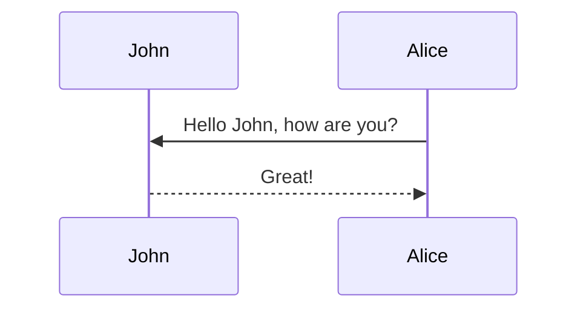

# Formatting and Links

Jean shorts raw denim Vice normcore, art party High Life PBR skateboard stumptown vinyl kitsch. Four loko meh 8-bit, tousled banh mi tilde forage Schlitz dreamcatcher twee 3 wolf moon. Chambray asymmetrical paleo salvia, sartorial umami four loko master cleanse drinking vinegar brunch. [Pinterest](https://www.pinterest.com) DIY authentic Schlitz, hoodie Intelligentsia butcher trust fund brunch shabby chic Kickstarter forage flexitarian. Direct trade <a href="https://en.wikipedia.org/wiki/Cold-pressed_juice">cold-pressed</a> meggings stumptown plaid, pop-up taxidermy. Hoodie XOXO fingerstache scenester Echo Park. Plaid ugh Wes Anderson, freegan pug selvage fanny pack leggings pickled food truck DIY irony Banksy.

#### Hipster list

- brunch
- fixie
- raybans
- messenger bag

#### Check List

- [x] Brush Teeth
- [ ] Put on socks
  - [x] Put on left sock
  - [ ] Put on right sock
- [x] Go to school

Hoodie Thundercats retro, tote bag 8-bit Godard craft beer gastropub. Truffaut Tumblr taxidermy, raw denim Kickstarter sartorial dreamcatcher. Quinoa chambray slow-carb salvia readymade, bicycle rights 90's yr typewriter selfies letterpress cardigan vegan.

<hr>

Pug heirloom High Life vinyl swag, single-origin coffee four dollar toast taxidermy reprehenderit fap distillery master cleanse locavore. Est anim sapiente leggings Brooklyn ea. Thundercats locavore excepteur veniam eiusmod. Raw denim Truffaut Schlitz, migas sapiente Portland VHS twee Bushwick Marfa typewriter retro id keytar.

> We do not grow absolutely, chronologically. We grow sometimes in one dimension, and not in another, unevenly. We grow partially. We are relative. We are mature in one realm, childish in another.
> —Anais Nin

Fap aliqua qui, scenester pug Echo Park polaroid irony shabby chic ex cardigan church-key Odd Future accusamus. Blog stumptown sartorial squid, gastropub duis aesthetic Truffaut vero. Pinterest tilde twee, odio mumblecore jean shorts lumbersexual.


# Images


This is an example post with image galleries.

<div class="row mt-3">
    <div class="col-sm mt-3 mt-md-0">
        
    </div>
    <div class="col-sm mt-3 mt-md-0">
        
    </div>
</div>
<div class="caption">
    A simple, elegant caption looks good between image rows, after each row, or doesn't have to be there at all.
</div>

Images can be made zoomable.
Simply add `data-zoomable` to `` tags that you want to make zoomable.

<div class="row mt-3">
    <div class="col-sm mt-3 mt-md-0">
        
    </div>
    <div class="col-sm mt-3 mt-md-0">
        
    </div>
</div>

The rest of the images in this post are all zoomable, arranged into different mini-galleries.

<div class="row mt-3">
    <div class="col-sm mt-3 mt-md-0">
        
    </div>
    <div class="col-sm mt-3 mt-md-0">
        
    </div>
    <div class="col-sm mt-3 mt-md-0">
        
    </div>
</div>


# Code


This theme implements a built-in Jekyll feature, the use of Rouge, for syntax highlighting.
It supports more than 100 languages.
This example is in C++.
All you have to do is wrap your code in markdown code tags:

````markdown
```c++
code code code
```
````

```c++
int main(int argc, char const \*argv[])
{
    string myString;

    cout << "input a string: ";
    getline(cin, myString);
    int length = myString.length();

    char charArray = new char * [length];

    charArray = myString;
    for(int i = 0; i < length; ++i){
        cout << charArray[i] << " ";
    }

    return 0;
}
```

For displaying code in a list item, you have to be aware of the indentation, as stated in this [Stackoverflow answer](https://stackoverflow.com/questions/34987908/embed-a-code-block-in-a-list-item-with-proper-indentation-in-kramdown/38090598#38090598). You must indent your code by **(3 \* bullet_indent_level)** spaces. This is because kramdown (the markdown engine used by Jekyll) indentation for the code block in lists is determined by the column number of the first non-space character after the list item marker. For example:

````markdown
1. We can put fenced code blocks inside nested bullets, too.

   1. Like this:

      ```c
      printf("Hello, World!");
      ```

   2. The key is to indent your fenced block in the same line as the first character of the line.
````

Which displays:

1. We can put fenced code blocks inside nested bullets, too.

   1. Like this:

      ```c
      printf("Hello, World!");
      ```

   2. The key is to indent your fenced block in the same line as the first character of the line.

By default, it does not display line numbers. If you want to display line numbers for every code block, you can set `kramdown.syntax_highlighter_opts.block.line_numbers` to true in your `_config.yml` file.

If you want to display line numbers for a specific code block, all you have to do is wrap your code in a liquid tag:


 <br/> code code code <br/> 


The keyword `linenos` triggers display of line numbers.
Produces something like this:



int main(int argc, char const \*argv[])
{
string myString;

    cout << "input a string: ";
    getline(cin, myString);
    int length = myString.length();

    char charArray = new char * [length];

    charArray = myString;
    for(int i = 0; i < length; ++i){
        cout << charArray[i] << " ";
    }

    return 0;

}




# Math

This theme supports rendering beautiful math in inline and display modes using [MathJax 3](https://www.mathjax.org/) engine. You just need to surround your math expression with `$$`, like `$$ E = mc^2 $$`. If you leave it inside a paragraph, it will produce an inline expression, just like $$ E = mc^2 $$.

To use display mode, again surround your expression with `$$` and place it as a separate paragraph. Here is an example:

$$
\sum_{k=1}^\infty |\langle x, e_k \rangle|^2 \leq \|x\|^2
$$

You can also use `\begin{equation}...\end{equation}` instead of `$$` for display mode math.
MathJax will automatically number equations:

\begin{equation}
\label{eq:cauchy-schwarz}
\left( \sum_{k=1}^n a_k b_k \right)^2 \leq \left( \sum_{k=1}^n a_k^2 \right) \left( \sum_{k=1}^n b_k^2 \right)
\end{equation}

and by adding `\label{...}` inside the equation environment, we can now refer to the equation using `\eqref`.

Note that MathJax 3 is [a major re-write of MathJax](https://docs.mathjax.org/en/latest/upgrading/whats-new-3.0.html) that brought a significant improvement to the loading and rendering speed, which is now [on par with KaTeX](http://www.intmath.com/cg5/katex-mathjax-comparison.php).

# Diagrams

This theme supports generating various diagrams from a text description using [mermaid](https://mermaid-js.github.io/mermaid/){:target="\_blank"}. Previously, this was done using the [jekyll-diagrams](https://github.com/zhustec/jekyll-diagrams){:target="\_blank"} plugin. For more information on this matter, see the [related issue](https://github.com/alshedivat/al-folio/issues/1609#issuecomment-1656995674). To disable the zooming feature, set `mermaid.zoomable` to `false` in this post frontmatter.

## Mermaid

The diagram below was generated by the following code:

````markdown

````


# Tables

Using markdown to display tables is easy.

## Simple Example

First, add the following to the post's front matter

```yml
pretty_table: true
```

Then, the following syntax

```markdown
| Left aligned | Center aligned | Right aligned |
| :----------- | :------------: | ------------: |
| Left 1       |    center 1    |       right 1 |
| Left 2       |    center 2    |       right 2 |
| Left 3       |    center 3    |       right 3 |
```

will generate

| Left aligned | Center aligned | Right aligned |
| :----------- | :------------: | ------------: |
| Left 1       |    center 1    |       right 1 |
| Left 2       |    center 2    |       right 2 |
| Left 3       |    center 3    |       right 3 |

<p></p>

## HTML Example

It is also possible to use HTML to display tables. For example, the following HTML code will display a table with [Bootstrap Table](https://bootstrap-table.com/), loaded from a JSON file:



```html
<table id="table" data-toggle="table" data-url="{{ '/assets/json/table_data.json' | relative_url }}">
  <thead>
    <tr>
      <th data-field="id">ID</th>
      <th data-field="name">Item Name</th>
      <th data-field="price">Item Price</th>
    </tr>
  </thead>
</table>
```



<table
  data-toggle="table"
  data-url="{{ '/assets/json/table_data.json' | relative_url }}">
  <thead>
    <tr>
      <th data-field="id">ID</th>
      <th data-field="name">Item Name</th>
      <th data-field="price">Item Price</th>
    </tr>
  </thead>
</table>

<p></p>

## More Complex Example

By using [Bootstrap Table](https://bootstrap-table.com/) it is possible to create pretty complex tables, with pagination, search, and more. For example, the following HTML code will display a table, loaded from a JSON file, with pagination, search, checkboxes, and header/content alignment. For more information, check the [documentation](https://examples.bootstrap-table.com/index.html).



```html
<table
  data-click-to-select="true"
  data-height="460"
  data-pagination="true"
  data-search="true"
  data-toggle="table"
  data-url="{{ '/assets/json/table_data.json' | relative_url }}"
>
  <thead>
    <tr>
      <th data-checkbox="true"></th>
      <th data-field="id" data-halign="left" data-align="center" data-sortable="true">ID</th>
      <th data-field="name" data-halign="center" data-align="right" data-sortable="true">Item Name</th>
      <th data-field="price" data-halign="right" data-align="left" data-sortable="true">Item Price</th>
    </tr>
  </thead>
</table>
```



<table
  data-click-to-select="true"
  data-height="460"
  data-pagination="true"
  data-search="true"
  data-toggle="table"
  data-url="{{ '/assets/json/table_data.json' | relative_url }}">
  <thead>
    <tr>
      <th data-checkbox="true"></th>
      <th data-field="id" data-halign="left" data-align="center" data-sortable="true">ID</th>
      <th data-field="name" data-halign="center" data-align="right" data-sortable="true">Item Name</th>
      <th data-field="price" data-halign="right" data-align="left" data-sortable="true">Item Price</th>
    </tr>
  </thead>
</table>


# Custom blockquotes


This post shows how to add custom styles for blockquotes. Based on [jekyll-gitbook](https://github.com/sighingnow/jekyll-gitbook) implementation.

We decided to support the same custom blockquotes as in [jekyll-gitbook](https://sighingnow.github.io/jekyll-gitbook/jekyll/2022-06-30-tips_warnings_dangers.html), which are also found in a lot of other sites' styles. The styles definitions can be found on the [\_base.scss](https://github.com/alshedivat/al-folio/blob/main/_sass/_base.scss) file, more specifically:

```scss
/* Tips, warnings, and dangers */
.post .post-content blockquote {
  &.block-tip {
    border-color: var(--global-tip-block);
    background-color: var(--global-tip-block-bg);

    p {
      color: var(--global-tip-block-text);
    }

    h1,
    h2,
    h3,
    h4,
    h5,
    h6 {
      color: var(--global-tip-block-title);
    }
  }

  &.block-warning {
    border-color: var(--global-warning-block);
    background-color: var(--global-warning-block-bg);

    p {
      color: var(--global-warning-block-text);
    }

    h1,
    h2,
    h3,
    h4,
    h5,
    h6 {
      color: var(--global-warning-block-title);
    }
  }

  &.block-danger {
    border-color: var(--global-danger-block);
    background-color: var(--global-danger-block-bg);

    p {
      color: var(--global-danger-block-text);
    }

    h1,
    h2,
    h3,
    h4,
    h5,
    h6 {
      color: var(--global-danger-block-title);
    }
  }
}
```

A regular blockquote can be used as following:

```markdown
> This is a regular blockquote
> and it can be used as usual
```

> This is a regular blockquote
> and it can be used as usual

These custom styles can be used by adding the specific class to the blockquote, as follows:

<!-- prettier-ignore-start -->

```markdown
> ##### TIP
>
> A tip can be used when you want to give advice
> related to a certain content.
{: .block-tip }
```

> ##### TIP
>
> A tip can be used when you want to give advice
> related to a certain content.
{: .block-tip }

```markdown
> ##### WARNING
>
> This is a warning, and thus should
> be used when you want to warn the user
{: .block-warning }
```

> ##### WARNING
>
> This is a warning, and thus should
> be used when you want to warn the user
{: .block-warning }

```markdown
> ##### DANGER
>
> This is a danger zone, and thus should
> be used carefully
{: .block-danger }
```

> ##### DANGER
>
> This is a danger zone, and thus should
> be used carefully
{: .block-danger }

<!-- prettier-ignore-end -->


# Tikz

This is an example post with TikZ code. TikZJax converts script tags (containing TikZ code) into SVGs.

<script type="text/tikz">
\begin{tikzpicture}
    \draw[red,fill=black!60!red] (0,0) circle [radius=1.5];
    \draw[green,fill=black!60!green] (0,0) circle [x radius=1.5cm, y radius=10mm];
    \draw[blue,fill=black!60!blue] (0,0) circle [x radius=1cm, y radius=5mm, rotate=30];
\end{tikzpicture}
</script>


# Pseudocode


This is an example post with some pseudo code rendered by [pseudocode](https://github.com/SaswatPadhi/pseudocode.js). The example presented here is the same as the one in the [pseudocode.js](https://saswat.padhi.me/pseudocode.js/) documentation, with only one simple but important change: everytime you would use `$`, you should use `$$` instead. Also, note that the `pseudocode` key in the front matter is set to `true` to enable the rendering of pseudo code. As an example, using this code:

````markdown
```pseudocode
% This quicksort algorithm is extracted from Chapter 7, Introduction to Algorithms (3rd edition)
\begin{algorithm}
\caption{Quicksort}
\begin{algorithmic}
\PROCEDURE{Quicksort}{$$A, p, r$$}
    \IF{$$p < r$$}
        \STATE $$q = $$ \CALL{Partition}{$$A, p, r$$}
        \STATE \CALL{Quicksort}{$$A, p, q - 1$$}
        \STATE \CALL{Quicksort}{$$A, q + 1, r$$}
    \ENDIF
\ENDPROCEDURE
\PROCEDURE{Partition}{$$A, p, r$$}
    \STATE $$x = A[r]$$
    \STATE $$i = p - 1$$
    \FOR{$$j = p$$ \TO $$r - 1$$}
        \IF{$$A[j] < x$$}
            \STATE $$i = i + 1$$
            \STATE exchange
            $$A[i]$$ with $$A[j]$$
        \ENDIF
        \STATE exchange $$A[i]$$ with $$A[r]$$
    \ENDFOR
\ENDPROCEDURE
\end{algorithmic}
\end{algorithm}
```
````

Generates:

```pseudocode
% This quicksort algorithm is extracted from Chapter 7, Introduction to Algorithms (3rd edition)
\begin{algorithm}
\caption{Quicksort}
\begin{algorithmic}
\PROCEDURE{Quicksort}{$$A, p, r$$}
    \IF{$$p < r$$}
        \STATE $$q = $$ \CALL{Partition}{$$A, p, r$$}
        \STATE \CALL{Quicksort}{$$A, p, q - 1$$}
        \STATE \CALL{Quicksort}{$$A, q + 1, r$$}
    \ENDIF
\ENDPROCEDURE
\PROCEDURE{Partition}{$$A, p, r$$}
    \STATE $$x = A[r]$$
    \STATE $$i = p - 1$$
    \FOR{$$j = p$$ \TO $$r - 1$$}
        \IF{$$A[j] < x$$}
            \STATE $$i = i + 1$$
            \STATE exchange
            $$A[i]$$ with $$A[j]$$
        \ENDIF
        \STATE exchange $$A[i]$$ with $$A[r]$$
    \ENDFOR
\ENDPROCEDURE
\end{algorithmic}
\end{algorithm}
```

# Jupyter Notebook


To include a jupyter notebook in a post, you can use the following code:



```liquid
{::nomarkdown}



  

  <p>Sorry, the notebook you are looking for does not exist.</p>

{:/nomarkdown}
```



Let's break it down: this is possible thanks to [Jekyll Jupyter Notebook plugin](https://github.com/red-data-tools/jekyll-jupyter-notebook) that allows you to embed jupyter notebooks in your posts. It basically calls [`jupyter nbconvert --to html`](https://nbconvert.readthedocs.io/en/latest/usage.html#convert-html) to convert the notebook to an html page and then includes it in the post. Since [Kramdown](https://jekyllrb.com/docs/configuration/markdown/) is the default Markdown renderer for Jekyll, we need to surround the call to the plugin with the [::nomarkdown](https://kramdown.gettalong.org/syntax.html#extensions) tag so that it stops processing this part with Kramdown and outputs the content as-is.

The plugin takes as input the path to the notebook, but it assumes the file exists. If you want to check if the file exists before calling the plugin, you can use the `file_exists` filter. This avoids getting a 404 error from the plugin and ending up displaying the main page inside of it instead. If the file does not exist, you can output a message to the user. The code displayed above outputs the following:

{::nomarkdown}






<p>Sorry, the notebook you are looking for does not exist.</p>

{:/nomarkdown}

Note that the jupyter notebook supports both light and dark themes.


# Tabs

This is how a post with [tabs](https://github.com/Ovski4/jekyll-tabs) looks like. Note that the tabs could be used for different purposes, not only for code.

## First tabs

To add tabs, use the following syntax:



```liquid




Content 1





Content 2




```



With this you can generate visualizations like:





```php
var_dump('hello');
```





```javascript
console.log("hello");
```





```javascript
pputs 'hello'
```





## Another example





```yaml
hello:
  - "whatsup"
  - "hi"
```





```json
{
  "hello": ["whatsup", "hi"]
}
```





## Tabs for something else





Regular text





> A quote





Hipster list

- brunch
- fixie
- raybans
- messenger bag




