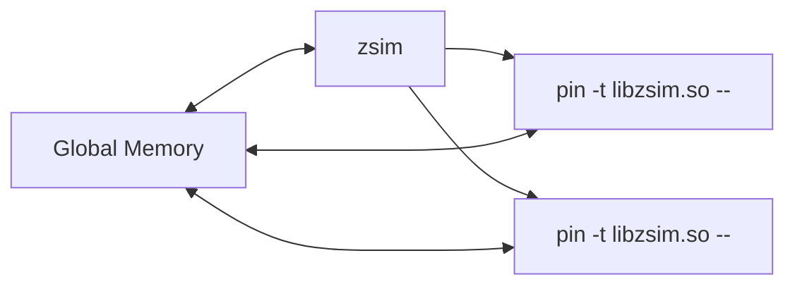

# zSim

## Basics

> reference: [micro48-tutorial](https://zsim.csail.mit.edu/tutorial/), [zsim-isca-paper](https://dl.acm.org/doi/10.1145/2508148.2485963)

### Motivation

> why not use gem5? why not FPGA?

* speed: gem5 ~200(?, to be verified) KIPS v.s. zsim 10s-1000s MIPS
* ease of use: compared to FPGA emulation

### Concepts


* Cycle/event-driven: simulate all stages cycle by cycle
* Instruction-driven: simulate all stages at once per ins/uop, accelerated by DBT

* gem5: full event-driven emulation
* zsim: DBT-based instruction-driven core + event-driven uncore

Dynamic Binary Translation (DBT) by [Intel Pin](https://software.intel.com/sites/landingpage/pintool/docs/98484/Pin/html/index.html) provides **free functional model**.


<div class="row mt-3">
    <div class="col-sm mt-3 mt-md-0">
        
    </div>
</div>
<div class="caption">
  zsim overview
</div>

#### Bound-Weave Parallelization

> not dived into this yet.
{: .block-warning}

#### Problems

* ZSim doesn't simulate wrong path execution
  * of course it matters, but to what extent? 
  * potential solution: https://heirman.net/papers/ispass2023wrongpath.pdf
* ZSim does badly for systems or workloads with frequent path-altering interference (e.g., fine-grained message-passing across whole chip)
  * does it matter for CGRA-like systems?

### Organization

`libzsim.so` (pintool) + `zsim` (harness)



All simulator objects must be allocated in the global heap. Global heap and `libzsim.so` code in same memory locations across all processes --- Can use normal pointers & virtual functions.

```c++
class SimObject : GlobAlloc {...}
g_vector<uint64_t> cacheLines;
```

### Core Model

DBT(Pin) with 4 types of analysis routine to cover program simulation:
* Basic block (BBL)
* Load and Store
* Branch

```asm
mov (%rbp),%rcx
Load(%rbp) # Load(Address addr) {L1D->load(addr);}
add %rax,%rbx
mov %rdx,(%rbp)
Store(%rbp) # Store(Address addr) {L1D->store(addr, val);}
BasicBlock (BblDescriptor {numInst=4,numBytes=4,uops{type,src,dst,lat,fu-port}})
ja 40530a 
```

```c++
BasicBlock(BblDescriptor) {
  foreach uop {
    // undergo all stages as the figure below shows
  }
}
```

<div class="row mt-3">
    <div class="col-sm mt-3 mt-md-0">
        
    </div>
</div>
<div class="caption">
  zsim OOO core model for every instruction
</div>

> Memory model things will be discussed in "Diving into Code"

### Diving into Code

I create a [fork](https://github.com/uv-xiao/zswarm), which includes docker setup for zsim. Code lines in this section are relative to the [commit](https://github.com/uv-xiao/zsim/commit/1d15beaaa521358cfc26e7c6109e07f182a28053).

> Acknowlegdement: I borrow the docker setup from [tartan](https://github.com/cmu-roboarch/tartan). I learned much from [microarch-in-zsim](https://wangziqi2013.github.io/article/2020/01/01/zsim-microarch.html).


Two paths: zSim path and application path.

Instructions in the simulated binary (application path) is still executed by the native hardware, except that at certain points, control will be transferred to the simulator (zSim path) by *routines*. The routines are named “analysis routines”, in which the timing model of zSim is implemented.

Related files:
* `zsim_harness.cpp`	Harness code for zSim, including configuration parsing and  Pin run launching.
* `zsim.cpp`	Instrumentation routines for basic blocks, loads and stores, and branch instructions.
* `decoder.h`	Pre-decoding and Decoding stage simulation; Instruction to uop translation; DynBbl, execution port definition; Register dependency definition.
* `core.h`	Core interface for analysis routines; Core interface for simulation.
* `ooo_core.h`	Out-of-Order core microarchitecture simulation, incluuding instruction fetch, instruction window, reorder buffer, loads and stores, and register file simulation.

For each process from the configuration, such as `process0` and `process1` in `simple.cfg`, the harness (`zsim_harness.cpp`) starts a Pin run for simulation (zsim_harness.cpp:233 `LaunchProcess(uint32_t procIdx)`). A Pin run looks like this:
```bash
/zswarm/pin-2.14-71313-gcc.4.4.7-linux/intel64/bin/pinbin -follow_execv -tool_exit_timeout 1 -ifeellucky -t /zswarm/zsim/build/opt/libzsim.so -config /zswarm/zsim/tests/simple.cfg -outputDir /zswarm/zsim/zrun -shmid 22 -traceToFile -procIdx 1 -- cat /zswarm/zsim/tests/simple.cfg
```

> Debugging features (in `zsim.cpp`, zsim.cpp:1490), FFI and Virt (in `zsim.cpp`, zsim.cpp:1533, zsim.cpp:1535) need more diving into code.
{: .block-warning}

Instrumentation routines of zSim are defined in `zsim.cpp`. `GlobSimInfo` holds system configuration values, all read-only, set at initialization. zSim registers a call back
`Trace()` to PIN using library call `TRACE_AddInstrumentFunction()`, at zsim.cpp:1538:
```c++
TRACE_AddInstrumentFunction(Trace, 0);
```
`Trace(TRACE trace, VOID *v)` (at zsim.cpp:603) is called every time PIN sees an uninstrumented trace during execution. It specifies how the trace should be instrumented in zSim. Specifically, it iterates through the basic blocks in the trace, decodes each BBL (zsim.cpp:607, decoder.cpp:1300), and inserts a call to `IndirectBasicBlock` (zsim.cpp:181, core.h:46, ooo_core.cpp:505) by `BBL_InsertCall()`. 

> [Pin Docs](https://software.intel.com/sites/landingpage/pintool/docs/98484/Pin/html/index.html) says, Pin's instrumentation is "just in time" (JIT). Instrumentation occurs immediately before a code sequence is executed for the first time. We call this mode of operation **trace instrumentation**... Pin breaks the trace into basic blocks, BBLs. A BBL is a single entrance, single exit sequence of instructions... Trace instrumentation utilizes the TRACE_AddInstrumentFunction API call.

> Note that basic blocks and traces are recognized by the Pin framework dynamically, meaning that a dynamic basic block (or trace) in Pin may be broken into two smaller basic blocks (traces) if a branch instruction jumps to the middle of the block (trace) in the run time. In this case, each new basic block (trace) will be re-instrumented by calling the instrumentation routine registered to Pin, and the old instrumentation will be discarded.

In `Trace(TRACE trace, VOID *v)`, zSim also iterates through instructions in the trace, and run `Instruction(ins)` (zsim.cpp:616) for instruction instrumentation. `Instruction` (zsim.cpp:535) prints the instruction by `PrintIp`, and for load/store/condbr instructions, it inserts callbacks including `IndirectLoadSingle`, `IndirectStoreSingle`, `IndirectPredLoadSingle`, `IndirectPredStoreSingle`, and `IndirectRecordBranch`. Note that if an instruction accesses multiple memory locations, 
or both loads from and stores into memory, multiple instrumentations will be injected for the same instruction. Load/store callbacks do nothing more than simply logging the address, which serves as the basis of memory system simulation. Condbr callbacks log the target address and branch outcome (taken or not taken) for branch prediction simulation. The callbacks trigger functions stored in `InstrFuncPtrs fPtrs[MAX_THREADS]` (at zsim.cpp:170).

Unsupported instructions (often implemented by prefixing a special no-op as "magic 
op") are also injected in `Instruction()` at zsim.cpp:528. It inserts callbacks to `HandleMagicOp`(zsim.cpp:1142). In general, **such instruction instrumentation enables more flexible customization**.

> Later in the Tartan case study, we will see how magic op is used to implement new instructions.
{: .block-tip}

#### Core Interface

`core.h` defines the core interface for analysis routines. 

`struct BblInfo` stores BBL information including size, #ins, uops, and **decoder cycles**. The last two is used for OOO core model only. In `BblInfo* Decoder::decodeBbl(BBL bbl, bool oooDecoding)` from `decoder.cpp`, Macro-op fusion is tried (decoder.cpp:1332). It models two steps of OOO decoder: pre-decode and decode. The docoding cycles are stored in `bblInfo->oooBbl[0].uop[i].decCycle`. The concrete instruction decoding is done in `Decoder::decodeInstr` (decoder.cpp:541), where `emitXXX()`s like `emitBasicOp()`, are called to emit uops. Every `instr` can have 0-2 src regs and 0-2 dst regs, stored in `uop.rs[0/1]` and `uop.rd[0/1]`. The decoder is shared by all core models.

`struct InstrFuncPtrs` stores analysis routine function pointers. During initialization, each core type creates an instance of `struct InstrFuncPtrs`, and populates this structure with its own static member functions. zSim stores the current instance being used in a global structure, `InstrFuncPtrs fPtrs[MAX_THREADS]` (at zsim.cpp:170). Here is a field list of `struct InstrFuncPtrs`:

| Field Name | Description | Core Method Called (`OOOCore`) |
|:--------------------------------:|--------------------------------|---|
| loadPtr | Called before instructions that read from memory for each operand | `OOOCore::LoadFunc()` |
| storePtr | Called before instructions that write into memory for each operand | `OOOCore::StoreFunc()` |
| bblPtr | Called before a basic block is about to be executed | `OOOCore::BblFunc()` |
| branchPtr | Called before control flow instructions, including conditional and unconditional branches | `OOOCore::BranchFunc()` |
| predLoadPtr | Called before predicated load instructions for each operand | `OOOCore::PredLoadFunc()` |
| predStorePtr | Called before predicated store instructions for each operand | `OOOCore::PredStoreFunc()` |
{:.mbtablestyle}


#### OOO Core Model

We first describe the behavior of analysis routines in `OOOCore`. `OOOCore::LoadFunc()` and `OOOCore::StoreFunc()` call `OOOCore::load()` and `OOOCore::store()` respectively, which log the memory access address into an array, `loadAddrs` and `storeAddrs`. These addresses will be used for cache system simulation after the current basic block has finished execution. Similarly, `OOOCore::PredLoadFunc()` and `OOOCore::PredStoreFunc()` log the addresses of predicated memory accesses if the condition evaluates to true, or -1 if false. `OOOCore::BranchFunc()` log the branch outcome, the taken
and not taken address, and the address of the branch instruction itself by setting fields `branchTaken`, `branchTakenNpc`, `branchNotTakenNpc` and `branchPc`. Only one entry for branch logging is required, since according to the definition, branches will only occur as the last instruction of a basic block.

`class OOOCore` is defined in `ooo_core.h` (at ooo_core.h:361).

#### OOO Simulation Details

> One extremely useful resource of microarchitectural documents
is [Agner's Blog](https://www.agner.org/optimize/), in which the structure of the pipeline and micro-op (uop) maps are described in detail. zSim also uses materials in this blog as a reference. Especially, it includes the [microarchitecture manual](microarchitecture) and the [instruction table](https://www.agner.org/optimize/instruction_tables.pdf) (also a [ods spreadsheet](https://www.agner.org/optimize/instruction_tables.ods)).


## Case study: Tartan

> todo
{: .block-warning}