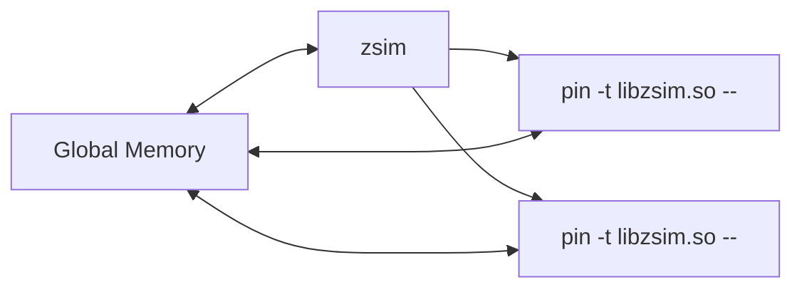

# ZSim

## Basics

> reference: [micro48-tutorial](https://zsim.csail.mit.edu/tutorial/), [zsim-isca-paper](https://dl.acm.org/doi/10.1145/2508148.2485963)

### Motivation

> why not use gem5? why not FPGA?

* speed: gem5 ~200(?, to be verified) KIPS v.s. zsim 10s-1000s MIPS
* ease of use: compared to FPGA emulation

### Concepts


* Cycle/event-driven: simulate all stages cycle by cycle
* Instruction-driven: simulate all stages at once per ins/uop, accelerated by DBT

* gem5: full event-driven emulation
* zsim: DBT-based instruction-driven core + event-driven uncore

Dynamic Binary Translation (DBT) by [Intel Pin](https://software.intel.com/sites/landingpage/pintool/docs/98484/Pin/html/index.html) provides **free functional model**.


<div class="row mt-3">
    <div class="col-sm mt-3 mt-md-0">
        
    </div>
</div>
<div class="caption">
  zsim overview
</div>

#### Bound-Weave Parallelization

> not dived into this yet.
{: .block-warning}

#### Problems

* ZSim doesn't simulate wrong path execution
  * of course it matters, but to what extent? 
  * potential solution: https://heirman.net/papers/ispass2023wrongpath.pdf
* ZSim does badly for systems or workloads with frequent path-altering interference (e.g., fine-grained message-passing across whole chip)
  * does it matter for CGRA-like systems?

### Organization

`libzsim.so` (pintool) + `zsim` (harness)



All simulator objects must be allocated in the global heap. Global heap and `libzsim.so` code in same memory locations across all processes --- Can use normal pointers & virtual functions.

```c++
class SimObject : GlobAlloc {...}
g_vector<uint64_t> cacheLines;
```

### Core Model

DBT(Pin) with 4 types of analysis routine to cover program simulation:
* Basic block (BBL)
* Load and Store
* Branch

```asm
mov (%rbp),%rcx
Load(%rbp) # Load(Address addr) {L1D->load(addr);}
add %rax,%rbx
mov %rdx,(%rbp)
Store(%rbp) # Store(Address addr) {L1D->store(addr, val);}
BasicBlock (BblDescriptor {numInst=4,numBytes=4,uops{type,src,dst,lat,fu-port}})
ja 40530a 
```

```c++
BasicBlock(BblDescriptor) {
  foreach uop {
    // undergo all stages as the figure below shows
  }
}
```

<div class="row mt-3">
    <div class="col-sm mt-3 mt-md-0">
        
    </div>
</div>
<div class="caption">
  zsim OOO core model for every instruction
</div>

> Memory model things will be discussed in "Diving into Code"

### Diving into Code

#### Setup

I create a [fork](https://github.com/uv-xiao/zswarm), which includes docker setup for zsim. 

> Acknowlegdement: I borrow the docker setup from [tartan](https://github.com/cmu-roboarch/tartan).

#### Microarchitecture

> refer to [microarch-in-zsim](https://wangziqi2013.github.io/article/2020/01/01/zsim-microarch.html)

Two paths: zSim path and application path.

Instructions in the simulated binary (application path) is still executed by the native hardware, except that at certain points, control will be transferred to the simulator (zSim path) by *routines*. The routines are named “analysis routines”, in which the timing model of zSim is implemented.

Related files:
* `zsim.cpp`	Instrumentation routines for basic blocks, loads and stores, and branch instructions.
* `decoder.h`	Pre-decoding and Decoding stage simulation; Instruction to uop translation; DynBbl, execution port definition; Register dependency definition.
* `core.h`	Core interface for analysis routines; Core interface for simulation.
* `ooo_core.h`	Out-of-Order core microarchitecture simulation, incluuding instruction fetch, instruction window, reorder buffer, loads and stores, and register file simulation.


## Case study: Tartan

> todo
{: .block-warning}