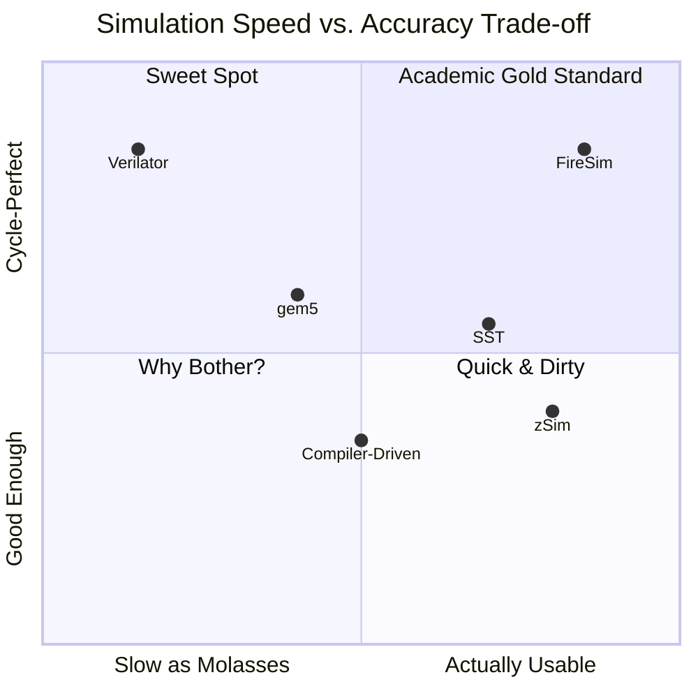

Recent papers to read:
- [ ] Assassyn: A Unified Abstraction for Architectural Simulation and Implementation
- [ ] Concorde: Fast and Accurate CPU Performance Modeling with Compositional Analytical-ML Fusion
- [ ] Performance Interfaces for Hardware Accelerators

Maybe write things for each of them? If I have time🥹

# The Simulation Landscape: Pick Your Poison

Ever had a brilliant idea for a new processor feature at 2 AM? Maybe you thought, "what if we had a cache that could predict the future?" or "could we make branch prediction psychic?" Welcome to the wonderful, frustrating, occasionally maddening world of computer architecture simulation!

Choosing the right simulator is like picking a character in an RPG: Do you go for the slow, powerful wizard (gem5) that can model anything but takes forever? Or the speedy rogue (zSim) that gets you results fast but might miss some details? Maybe you're feeling rich and want the ultimate pay-to-win option (FireSim on AWS)?

After years of banging my head against various simulators (and occasionally wanting to throw my laptop out the window), I've learned that each tool has its own personality, quirks, and sweet spots. This post is my attempt to save you some pain and help you pick the right tool for your research without losing your sanity.

## Architectural Simulators: Where Dreams Meet Reality (Very, Very Slowly)

Architectural simulators are where most of us start our journey. These bad boys model your processor at the microarchitectural level - think pipelines, caches, branch predictors, the works. The catch? They're not exactly speed demons. But hey, when you need to know *exactly* how many cycles your brilliant idea saves, these are your friends.

### gem5: The All-Powerful, All-Complicated Behemoth

Ah, gem5 [Binkert et al., "The gem5 simulator," 2011](https://research.cs.wisc.edu/multifacet/papers/can11_gem5.pdf). If computer architecture simulators were cars, gem5 would be a Formula 1 car that you have to assemble yourself from 10,000 parts while reading documentation written by someone who assumes you already built five F1 cars.

**The Good:**
- Can model basically anything. Want a 128-core processor with a telepathic cache? gem5's got you.
- Multiple CPU models from dead simple (AtomicSimple) to "why does this have so many pipeline stages" (O3)
- Full-system simulation - yes, it can boot Linux. Very. Very. Slowly.
- Supports every ISA under the sun: ARM, x86, RISC-V, and probably some alien architectures

**The Reality Check:**
- Simulation speed: 10-200 KIPS. That's Kilo-Instructions Per Second. Not Mega. Not Giga. *Kilo*.
- My first gem5 setup took a week and more coffee than I care to admit
- The configuration system is "flexible" in the same way quantum mechanics is "intuitive"
- Memory usage scales with complexity - I've seen gem5 eat 64GB of RAM and ask for seconds

**When to Use gem5:**
- Your advisor said "use gem5" (the most common reason)
- You need to publish a paper and reviewers expect gem5 results
- You're modeling something genuinely novel that needs cycle-accurate detail
- You have infinite patience or really good coffee

**Pro Tip:** Start with the gem5 bootcamp examples. Don't try to build your dream processor on day one. Trust me on this.

### zSim: The Speed Demon from MIT

zSim [Sanchez & Kozyrakis, "ZSim: Fast and accurate microarchitectural simulation of thousand-core systems," ISCA 2013](https://people.csail.mit.edu/sanchez/papers/2013.zsim.isca.pdf) is what happens when someone at MIT gets fed up with gem5's speed and decides to do something about it. The result? A simulator that's actually fast enough to finish experiments before the conference deadline.

**The Magic Sauce:**
- **Bound-Weave Parallelization**: Sounds fancy, but basically means "we figured out how to parallelize the hell out of this"
- **Pin-based execution**: Rides on Intel Pin like a rocket-powered skateboard
- **Instruction-driven timing**: Instead of simulating every cycle (like gem5's masochistic approach), zSim says "let's just figure out how long each instruction takes"

**Real Talk Performance:**
- 10s to 1000s MIPS - that's *Millions* with an M!
- I've seen 100× speedups over gem5. Not a typo.
- Can actually simulate real workloads without growing a beard

**The Catch:**
- Less detailed than gem5 (but often good enough)
- x86-only last I checked
- Some microarchitectural details are approximated

**When to Use zSim:**
- You need results this decade
- You're studying multicore systems (it scales beautifully)
- Your research is more about cache hierarchies than pipeline details
- You value your sanity

### SST: When You Need to Simulate a Supercomputer

SST [Rodrigues et al., "The structural simulation toolkit," ACM SIGMETRICS 2011](https://dl.acm.org/doi/10.1145/1964218.1964225) is what happens when the folks at Sandia National Labs need to simulate something bigger than your average processor. This is the tool for when you're thinking less "how many cache misses?" and more "how do 10,000 nodes talk to each other without catching fire?"

**What Makes SST Special:**
- Component-based design - like LEGO blocks for supercomputers
- Actually runs in parallel (because simulating parallel systems serially is just sad)
- Plays nice with other simulators - the diplomatic option
- Network modeling that doesn't make you cry

**Perfect For:**
- "I need to simulate an entire datacenter" problems
- Network topology research (mesh? torus? hypercube? SST's got you)
- When your scale unit is racks, not cores

### DAM: For When Von Neumann Just Isn't Weird Enough

DAM [Zhang et al., "The Dataflow Abstract Machine Simulator Framework," ISCA 2024](https://ppl.stanford.edu/papers/DAM_ISCA24.pdf) is the rebel of the simulation world. While everyone else is simulating nice, orderly von Neumann machines, DAM is over here simulating dataflow architectures - where data flows like water and control flow is more of a suggestion.

DAM uses a clever CSP (Communicating Sequential Processes) programming model with "contexts" (nodes) and "channels" (edges). It avoids global synchronization bottlenecks through a scalable point-to-point scheme, making it possible to simulate systems with thousands of components. Think of it as building a massive water park where each slide (context) runs independently, connected by pipes (channels) that handle the flow timing automatically.

**The Dataflow Difference:**
- No program counter? No problem!
- Event-driven simulation because instructions execute when they damn well please
- Perfect for those "what if we completely rethink computing" moments

**Use This When:**
- You're exploring dataflow processors (there are dozens of us!)
- Stream processing is your jam
- You enjoy explaining to people why your processor doesn't have a program counter

### Compiler-Driven Simulation: When Your Compiler Becomes a Crystal Ball

This approach [Li et al., "Compiler-Driven Simulation of Reconfigurable Hardware Accelerators," HPCA 2022](https://arxiv.org/abs/2202.00739) is the new hotness - letting your compiler figure out how fast your accelerator will run before you even build it. It's like having a fortune teller for your hardware designs, except it actually works (most of the time).

**The EQueue Magic:**
The paper introduces the Event Queue (EQueue) dialect of MLIR that sits perfectly between "too low-level" RTL and "too high-level" models. EQueue can:
- Model arbitrary hardware with explicit data movement
- Use distributed event-based control (no global clock headaches!)
- Guide design improvements with visualizable outputs
- Match RTL accuracy while being way easier to modify

**Real Impact:** They showed it working on systolic arrays and SIMD processors, proving you can have your cake (accuracy) and eat it too (fast iteration).

**Why This is Actually Cool:**
- Design space exploration without wanting to quit grad school
- Test 100 accelerator variants in the time it takes to simulate one in RTL
- Hardware/software co-design that doesn't require a PhD in both

## RTL Simulators: Where the Rubber Meets the Road

### Verilator: The People's Champion of RTL Simulation

Verilator [Snyder, "Verilator and SystemPerl," 2004](https://veripool.org/papers/) is what happens when the open-source community says "screw expensive commercial simulators" and builds something better. It takes your Verilog, turns it into C++, and runs it at speeds that make other simulators jealous.

**Why Verilator Rocks:**
- Verilog → C++ → ZOOM ZOOM
- Free as in freedom (and beer)
- Actually fast enough to run real software on your simulated CPU
- Used by basically every RISC-V project ever

**The Speed Secret:**
- Compiles your hardware to software (meta, right?)
- No interpreter overhead - just raw compiled code
- I've seen 100× speedups over traditional simulators

**Perfect For:**
- "I need to verify my RISC-V core" (join the club!)
- Pre-silicon software development
- When you need cycle-accurate but also want results today
- Impressing your friends with open-source superiority

### Cuttlesim: For the Functional Programming Hardware Nerds

Cuttlesim [Pit-Claudel et al., "Effective simulation and debugging for a high-level hardware language using software compilers," ASPLOS 2021](https://pit-claudel.fr/clement/papers/cuttlesim-ASPLOS21.pdf) is what you get when someone looks at Verilog and says "you know what this needs? More monads!" It's the simulator for Koika, a hardware description language that brings functional programming to hardware design.

**The Secret Sauce:**
Cuttlesim beats state-of-the-art RTL simulators by 2-5× by being smart about Koika's "early-exit" semantics. Instead of simulating every wire wiggle, it compiles rules directly to C++ that's optimized for how CPUs actually work. The generated code is so clean you can debug your hardware using GDB. Yes, really.

**The Koika Philosophy:**
- Hardware as concurrent rules that *appear* atomic (mind = blown)
- Formal verification built-in (bugs are so mainstream)
- Think Bluespec but with a PhD in type theory
- People who think Verilog isn't abstract enough
- Researchers exploring "what if hardware design didn't suck?"
- Those who enjoy explaining monads AND flip-flops at parties

## FPGA Emulation: When Software Just Isn't Cutting It

### FireSim: The "I Have Grant Money" Option

FireSim [Karandikar et al., "FireSim: FPGA-accelerated cycle-exact scale-out system simulation in the public cloud," ISCA 2018](https://www2.eecs.berkeley.edu/Pubs/TechRpts/2018/EECS-2018-154.pdf) is what happens when Berkeley researchers look at AWS F1 instances and think "you know what would be cool? Simulating an entire datacenter on these bad boys." And then they actually did it, the absolute madlads.

**The FireSim Magic:**
- **Golden Gate Compiler**: Takes your RTL and makes it cloud-ready (no sacrifice required)
- **AWS F1 Integration**: Hope you have that grant money ready!
- **Distributed Simulation**: Because why simulate one chip when you can simulate thousands?

**What You Can Actually Do:**
- Simulate thousands of cores without your lab catching fire
- Run real software stacks at decent speeds
- Test datacenter-scale ideas without buying a datacenter
- Make your advisor very happy (and very poor)

**Performance That Makes You Smile:**
- 10-100× faster than software simulation
- Can run real workloads in reasonable time
- Network simulation that actually behaves like a network

**The Price of Glory:**
- AWS bills that make you question your life choices
- Setup complexity that requires a PhD in cloud computing
- "Did you remember to terminate those instances?" anxiety

**Perfect For:**
- Datacenter research with actual scale
- "What if we had 1000 cores?" questions
- Impressing reviewers with scale
- Spending someone else's money on AWS

## The Speed-Accuracy Trade-off Visualized

Before we dive into FPGA solutions, let me show you the fundamental trade-off in simulation land:

## The Bottom Line: Which Simulator Should You Use?

After all this, you're probably wondering "just tell me which one to use!" Here's my totally biased but battle-tested advice:

### The Quick Reference Guide

| Simulator | Speed | Accuracy | Best For | Avoid If |
|:---|:---:|:---:|:---|:---|
| gem5 | 🐌 | 🎯🎯[🎯]? | Papers, microarch details | You have deadlines |
| zSim | 🚀🚀 | 🎯[🎯]? | Multicore, cache studies | You need RTL accuracy |
| SST | 🚀 | 🎯🎯 | Networks, large systems | You're studying single cores |
| Verilator | 🐌🐌 | 🎯🎯🎯 | RTL verification | You hate Verilog |
| FireSim | 🚀🚀 | 🎯🎯🎯 | Scale + accuracy | You're paying |
{:.table-responsive}

### What Each Tool Does Best

- **Need to model a complex out-of-order core?** gem5 (and patience)
- **Studying cache hierarchies?** zSim all day
- **Building a network-on-chip?** SST has your back
- **Verifying your Verilog?** Verilator is your friend
- **Prefering rule-based HDLs?** Cuttlesim
- **Simulating a datacenter?** FireSim (and a credit card)
- **Exploring weird architectures?** DAM/EQueue for dataflow

### The Learning Curve Reality Check

- **"I Can Figure This Out in a Day"**: Verilator (if you know Verilog)
- **"Give Me a Week"**: zSim, SST basics
- **"This is My Semester Project"**: gem5 mastery, FireSim setup
- **"I Now Have Stockholm Syndrome"**: gem5 Ruby, custom FPGA platforms

## Where's This All Going? The Crystal Ball Section

### ML Everything (Because Of Course)

Everyone's slapping ML onto their simulators now:
- **Performance Prediction**: "What if we just guess instead of simulating?" (Sometimes works!)
- **Smart Workload Generation**: ML picks representative benchmarks so you don't have to
- **Design Space Exploration**: Let the robots find your optimal cache size

## Wrapping Up: The Survival Guide

### The Philosophy

At the end of the day, simulators are just tools. The best simulator is the one that answers your research question without driving you to madness. Sometimes that's gem5 grinding away for days. Sometimes it's a quick zSim run that gets you 80% of the answer in an hour.

Choose wisely, simulate responsibly, and remember: every KIPS of gem5 simulation is building character. Or at least that's what I tell myself while waiting for results.

Happy simulating! May your runs be fast and your results be publishable. 🚀

---

## Appendix: Resources That Will Actually Help

### Getting Started Guides That Don't Suck

**gem5**: Start with the [gem5 bootcamp](https://github.com/gem5bootcamp/bootcamp). Actually do the exercises. Yes, all of them.

**zSim**: The [tutorial](https://github.com/s5z/zsim) is decent. The real learning happens when you try to add your first feature.

... more to come

