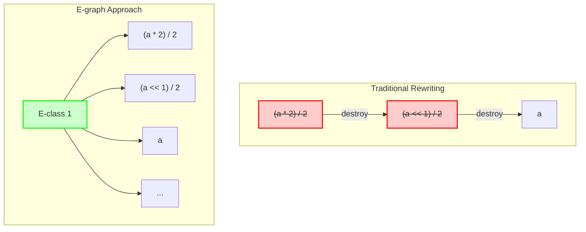

<iframe src="{{ site.url }}/assets/slide/egg" width="100%" height="500px" frameborder="0" allowfullscreen></iframe>

I still remember my first serious attempt at writing a compiler optimizer. I had this clever rule: `(a * 2) / 2 → a`. Simple, right? But then I realized that by eagerly applying it, I was destroying the pattern `(a * 2)` that another rule needed for vectorization. This is the optimizer's eternal dilemma: every choice you make closes doors to other opportunities.

For decades, we've played this high-stakes game of optimization whack-a-mole, carefully ordering our transformations and hoping we don't paint ourselves into a corner. But what if I told you there's a way to have your cake and eat it too? What if you could apply ALL your optimizations at once and then pick the best result?

Welcome to the world of **e-graphs** and **equality saturation** - where we don't choose between optimizations, we choose from *all possible* optimizations. It's like having a time machine for your compiler passes, except it actually works.

## The Problem: Why Traditional Optimization is Like Playing Jenga

Before we dive into the solution, let's understand why optimization is so darn hard. Traditional compilers use **term rewriting** - they see a pattern in your code and replace it with something better. Sounds great, right? Well...

## Term Rewriting: The Old School Approach

### How It Works (The Cookbook Analogy)

Think of **term rewriting** [Baader & Nipkow, "Term rewriting and all that," 1998] like following a very literal recipe. You have your ingredients (the program), and a set of substitution rules (the recipe steps). When you see "2 cups of sugar", you can replace it with "1 cup of honey".

In programming terms:
- **Terms**: Your code expressions, like `(a + 0) + (b + 0)`
- **Rules**: Transformations like "x + 0 → x" (because adding zero is pointless)
- **Context**: The surrounding code that doesn't change

**A Simple Example:**
Let's optimize `(a + 0) + (b + 0)` with the rule `x + 0 → x`:

```
Original: (a + 0) + (b + 0)
Apply rule to first part: a + (b + 0)
Apply rule to second part: a + b
```

Seems great! But here's the catch...

### The Problems: Why This Gets Messy Fast

**The Termination Trap:** Sometimes rules can ping-pong forever:
```
x + y → y + x  (commutivity)
y + x → x + y  (oops, infinite loop!)
```

**The Confluence Conundrum:** Different rule orders give different results:
```
(a * 2) / 2
  ↓ (optimize multiply)     ↓ (optimize divide)
(a << 1) / 2                a * (2/2)
  ↓                         ↓
???                         a
```

One path leads to `a`, the other to... who knows? This is why compiler writers lose sleep.

### The Band-Aid: Rewrite Strategies

Compiler writers tried to fix this with "strategies" - basically recipes for *how* to apply rules. It's like saying "always start cooking from the outside in" or "season as you go".

```scala
// "Apply this optimization to the outermost loops first"
def outermost = applyToOuterLoopsFirst

// "Then tile the matrix multiply"
tile(32,32) after outermost
```

But this is still just organized guessing. What if the optimal strategy for one program is terrible for another? Enter e-graphs, stage left.

## E-graphs: The "Keep Everything" Revolution

### The Big Idea (Detective's Corkboard Analogy)

Imagine you're a detective trying to solve a case. Traditional optimization is like having to choose one lead and throw away all the others. E-graphs [Nelson & Oppen, "Fast decision procedures based on congruence closure," 1980]? That's like having a corkboard where you can pin up EVERY clue and connect them with red string.

An **e-graph** (equality graph) is a data structure that stores multiple equivalent expressions simultaneously. When you discover that `x * 2` equals `x << 1`, you don't replace one with the other - you just connect them with a piece of string saying "these are the same!"

The magic is that e-graphs store all this information incredibly efficiently by sharing common sub-expressions. It's like realizing that five different theories all use the same piece of evidence, so you only need to pin it up once.

### How E-graphs Actually Work

An e-graph has two main concepts:

**E-nodes**: These are your actual expressions, like `a + b` or `foo(x, y)`. Think of them as the individual clues on your corkboard.

**E-classes**: These are groups of equivalent e-nodes. If `x * 2`, `x << 1`, and `x + x` are all equivalent, they live in the same e-class. It's like having a circle drawn around related clues.

The clever bit? E-graphs use a **union-find** data structure (think: extremely efficient way to group things) to keep track of which expressions are equivalent. When you discover a new equivalence, you just union two e-classes together. Boom! Instant optimization propagation.

### The E-graph API: Just Four Operations

E-graphs are beautifully simple. You only need four operations:

1. **add(expression)**: "Hey e-graph, remember this expression"
2. **merge(id1, id2)**: "BTW, these two things are equal"
3. **find(id)**: "What group is this expression in?"
4. **ematch(pattern)**: "Find me all expressions that look like this"

That's it! With these four operations, you can build incredibly sophisticated optimizers. It's like LEGO blocks for compiler writers.

### E-matching: Finding Patterns in the Chaos

E-matching is like playing Where's Waldo, but Waldo could be wearing different outfits (equivalent expressions). You give it a pattern like "find all `x + 0` expressions" and it searches through the entire e-graph.

```python
def find_optimization_opportunities(pattern, egraph):
    # "Show me everything that looks like x + 0"
    for group in egraph.all_groups():
        for expression in group.expressions:
            if looks_like(pattern, expression):
                yield "Found one!", expression
```

The beautiful part? Because the e-graph maintains equivalences, when you find `(a * 2) + 0`, you automatically know about `(a << 1) + 0` too!

### The Magic: Non-Destructive Rewriting

Here's where e-graphs blow your mind. In traditional rewriting:
```
(a * 2) / 2 → a    // Bye bye, original expression!
```

In e-graphs:
```
(a * 2) / 2 ≅ a    // Both exist! They're friends now!
```

The process:
1. Find all instances of your pattern (like `(x * 2) / 2`)
2. Calculate what they should become (`x`)
3. Don't replace! Just merge the e-classes

It's like saying "these two expressions are pen pals" instead of "this expression is dead to me." Much more civilized.

### Visual Example: The Old Way vs. The E-graph Way



## Equality Saturation: Going Full Detective Mode

### The Phase Ordering Problem (Why Order Matters)

Remember that game where you have to get the fox, chicken, and grain across the river? Traditional optimization is like that, but with 1000 items and no clear rules. This is the dreaded **phase ordering problem** [Tate et al., "Equality saturation: A new approach to optimization," POPL 2009].

Example with `(a * 2) / 2`:
```
Path 1: Optimize multiplies first
(a * 2) / 2 → (a << 1) / 2 → ... → ???

Path 2: Apply algebra first  
(a * 2) / 2 → a * (2/2) → a * 1 → a ✓
```

One path gets you the optimal result, the other gets you stuck. But how do you know which path to take? You don't. Until now.

### Equality Saturation: The "Try Everything" Algorithm

Here's the brilliant insight: What if we just... didn't choose? What if we applied ALL the optimizations at once and sorted it out later?

```python
def equality_saturation(expr, rules):
    egraph = start_with(expr)
    
    while "we're still finding new stuff":
        for rule in rules:
            # Find everywhere this rule could apply
            matches = egraph.find_pattern(rule.pattern)
            
            for match in matches:
                # Apply the rule (non-destructively!)
                new_expr = rule.apply_to(match)
                egraph.add(new_expr)
                egraph.merge(match, new_expr)
        
        if "nothing new was discovered":
            break  # We're saturated!
    
    return egraph.pick_best_expression()
```

**The Algorithm in Plain English:**
1. Start with your expression
2. Apply every possible rule everywhere you can
3. Keep all the results (don't throw anything away!)
4. Repeat until you can't find any new equivalences
5. Pick the best final result

It's like letting a hyperactive monkey loose in an optimization candy store, then picking the best candy it found. Chaotic? Yes. Effective? Absolutely.

### Extraction: Picking the Best from the Buffet

Okay, so we've applied every optimization known to mankind and our e-graph is stuffed with equivalent expressions. Now what? We need to pick the "best" one. This is called **extraction**.

**The Catch:** Remember when I said this was all magical? Well, here's the punchline - picking the optimal expression from an e-graph is NP-hard. It's like being told the treasure is buried "somewhere on Earth." Thanks, very helpful.

**The Problem:**
- You need to pick one expression from each e-class
- But the choices are interdependent (picking `a + b` in one place might make `b + a` better elsewhere)
- Finding the global optimum is computationally brutal

But don't worry! We have tricks up our sleeve...

#### Approach 1: The Mathematician's Solution (ILP)

You can formulate extraction as an Integer Linear Programming problem. Basically, you're asking a very expensive solver to find the optimal solution.

```
Minimize: total cost of selected expressions
Subject to:
  - Pick at least one thing from each e-class
  - If you pick an expression, pick all its children
  - Don't create cycles (no circular reasoning!)
```

**Pro:** Guaranteed optimal solution!
**Con:** Might take until the heat death of the universe for large programs.

#### Approach 2: The Graph Theorist's Dream (Dynamic Programming)

If your e-graph has nice structure (technically: low treewidth), you can use dynamic programming. It's like solving a puzzle by breaking it into smaller, manageable pieces.

**The Idea:** 
- Decompose the e-graph into a tree of "bags"
- Solve each bag independently
- Combine solutions cleverly

**When It Works:** Great for e-graphs that look like trees with a few extra edges
**When It Doesn't:** Not so great for e-graphs that look like hairballs

#### Approach 3: The Engineer's "Good Enough" (Heuristics)

Most real systems say "perfect is the enemy of good" and use heuristics:

**Bottom-up Greedy:** Start from the leaves, pick the cheapest option at each level
```python
def extract_greedy(eclass):
    if eclass.is_leaf():
        return cheapest_option(eclass)
    
    # Try each option with greedy children
    best = None
    for expr in eclass:
        cost = expr.cost + sum(extract_greedy(child) for child in expr.children)
        if cost < best.cost:
            best = expr
    return best
```

**Pool Extraction:** The "throw spaghetti at the wall" approach:
1. Generate 100 different extractions using various strategies
2. Add some random ones for spice
3. Evaluate them all
4. Pick the winner

Surprisingly effective! Like how a room full of monkeys with typewriters occasionally produces Shakespeare.

## Enter egg: The Game Changer 🥚

For years, e-graphs were like fusion power - always 10 years away from being practical. They were slow, hard to implement, and each one was a custom job. Then came **egg** [Willsey et al., "egg: Fast and extensible equality saturation," POPL 2021](https://arxiv.org/abs/2004.03082) (e-graphs good!).

### Why egg Changed Everything

Before egg: "I'll spend 6 months implementing an e-graph for my specific problem"
After egg: "I'll have a working optimizer by lunch"

**The Secret Sauce:**

1. **Rebuilding Magic:** Instead of constantly maintaining the e-graph (expensive!), egg says "let's batch everything and fix it periodically." It's like cleaning your room once a week instead of after every sock.

2. **E-class Analysis:** This is the killer feature. You can attach arbitrary data to e-classes. Is this expression a constant? What's its type? Does it have side effects? Now your rewrites can be smart:
   ```rust
   // Only optimize division if we know it's not divide-by-zero!
   rewrite!("div-safe"; "(/ ?x ?y)" => "?x" if is_one(?y))
   ```

3. **It's FAST:** 20× faster than previous implementations. That's the difference between waiting minutes and waiting days.

### E-class Analysis: Making Your E-graph Smart

Remember how I said e-graphs keep all equivalent expressions? Well, what if each group could also remember facts about itself? That's e-class analysis.

```rust
// "Hey e-graph, remember that this expression is always positive"
// "This one is a constant with value 42"
// "This expression has no side effects"
```

**Real Examples:**

**Constant Folding:**
```rust
analysis: ConstantFold
e-class: {2+2, 4, 2*2, 2<<1}
analysis says: "BTW, this whole e-class equals 4"
```

**Range Analysis:**
```rust
analysis: IntervalAnalysis  
e-class: {x*x, pow(x,2)}
analysis says: "This is always ≥ 0"
// Now you can optimize sqrt(x*x) → abs(x)!
```

It's like each e-class has a personal assistant keeping track of important facts.

### Conditional Rewrites: Smart Optimizations

With e-class analysis, your rewrites can be conditional. It's like having optimization rules that say "only do this if you're sure it's safe."

```rust
// Old way: "Always optimize x/y to something"
// New way: "Only optimize x/y if y isn't zero"

rewrite!("safe-div"; "(/ ?x ?y)" => "?x" 
  if is_one(?y));  // Only if y = 1

rewrite!("pythagoras"; "(sqrt (+ (* ?x ?x) (* ?y ?y)))" => "(abs ?z)"
  if is_complex(?z) && ?z = ?x + ?y*i);  // Complex number optimization!
```

**My Favorite Examples:**
```rust
// Strength reduction, but only for powers of 2
rewrite!("mul-to-shift"; "(* ?x ?c)" => "(<< ?x ?n)"
  if is_power_of_two(?c) && ?n = log2(?c));

// Remove assertions that we can prove are true
rewrite!("remove-true-assert"; "(assert ?cond ?expr)" => "?expr"
  if can_prove(?cond));
```

It's optimization with a brain!

## Quick Comparison: Traditional vs E-graphs

Let me break it down for you:

| Feature | Traditional Term Rewriting | E-graphs + Equality Saturation | 
|---------|---------------------------|--------------------------------|
| **Core Idea** | Apply one rule at a time, destroy the original | Keep everything, explore all paths |
| **Analogy** | Following a strict recipe | Detective's corkboard with red string |
| **Phase Ordering** | "Pick the right order or suffer" | "What's phase ordering?" 😎 |
| **Optimization Quality** | Depends on rule order | Finds optimal (given enough time) |
| **Speed** | Fast per rule | Slower but does everything at once |
| **Memory Usage** | Minimal | "RAM is cheap, right?" |
| **When to Use** | Simple, local optimizations | Complex, whole-program optimization |
| **Main Weakness** | Gets stuck in local optima | Extraction is NP-hard |

## Real-World Success Stories

### Herbie: Making Floating-Point Math Not Suck

Floating-point arithmetic is where good programmers go to cry. You write `sqrt(x+1) - sqrt(x)` and for large x, you get... 0? Thanks, floating point! Enter Herbie [Panchekha et al., "Automatically improving accuracy for floating point expressions," PLDI 2015](https://herbie.uwplse.org/pldi15-paper.pdf).

**The Herbie Magic:**
Herbie uses egg to find mathematically equivalent expressions that don't suffer from catastrophic cancellation:

```
Original: sqrt(x+1) - sqrt(x)
Problem: When x is large, both sqrts are nearly equal → precision loss

Herbie finds: 1/(sqrt(x+1) + sqrt(x))
Why better: No subtraction of nearly-equal numbers!
```

**The Punchline:** 
- 3000× faster than the old Herbie (not a typo!)
- Accuracy improved from 53% to 99.7%
- Turns numerical analysis PhD problems into "push button, get answer"

I've used Herbie on real code. It's like having a numerical analysis expert on speed dial.

### Hardware Design: Making Chips Cheaper

**The Problem:** You're designing a chip. Every gate costs money. Every nanosecond of delay costs performance.

**E-graphs to the Rescue:**
```verilog
// Original hardware:
result = (x == y) ? x + y : 0

// E-graph finds:
result = (x == y) ? 2*y : 0  // One less adder input!
```

**Real Example from E-Syn:**
They used egg + machine learning to optimize hardware designs:
1. E-graph explores equivalent circuits
2. ML model predicts area/delay without synthesis
3. Pick the best one

Result? 30% smaller circuits with same functionality. That's millions of dollars saved in chip production!

### Compiler Magic: Cranelift and Friends

**Cranelift ægraphs:** WebAssembly's compiler using e-graphs:
- Problem: How do you apply e-graphs when you have control flow?
- Solution: "Let's just e-graph the straight-line code and keep the control flow separate"
- Result: Fast compilation with good optimization

**Diospyros** [VanHattum et al., "Vectorization for digital signal processors via equality saturation," ASPLOS 2021](https://dl.acm.org/doi/10.1145/3445814.3446707): Vectorization on steroids:
```
// Original loop:
for i in 0..n:
    c[i] = sqrt(a[i]) + b[i]

// Diospyros finds the exact vector instructions:
vec_sqrt_add(a, b)  // One instruction instead of n*2!
```

**The Catch:** E-graphs can explode for large programs. Optimizing 8×8×8 matrix multiply? Hope you have RAM to spare!

**Isaria's Innovation:** 
"What if we automatically learned rewrite rules from the instruction manual?"
- Feed it ISA documentation
- It generates rewrite rules automatically
- Your compiler understands new instructions without manual work

## Egglog: The Next Generation 🤯

### What if E-graphs Could Think?

Egglog [Zhang et al., "Better Together: Unifying Datalog and Equality Saturation," PLDI 2023](https://arxiv.org/abs/2304.04332) is what happens when someone looks at e-graphs and says "this is cool, but what if we added Prolog?" It's e-graphs meets logic programming, and it's wild.

**The Big Idea:** Instead of just tracking equivalences, what if we could reason about relationships?

```prolog
// Traditional e-graph: "These expressions are equal"
// Egglog: "These expressions are equal AND here's why AND here's what else we can deduce"
```

**Example That Blew My Mind:**
```datalog
(datatype Math
  (Num i64)
  (Add Math Math)
  (Mul Math Math))

// Normal rewrites
(rewrite (Add (Num 0) x) x)
(rewrite (Mul (Num 1) x) x)

// But also relations!
(relation is-positive (Math))
(rule ((= x (Mul y y))) ((is-positive x)))  // Squares are positive

// Now optimizations can use reasoning
(rewrite (sqrt (Mul x x)) x 
  if (is-positive x))  // Safe because we proved it!
```

### Egglog Superpowers

**Program Analysis on Steroids:**
```datalog
// "Which basic blocks can reach the exit?"
(relation reaches-exit (BasicBlock))
(rule ((is-exit ?block)) ((reaches-exit ?block)))
(rule ((edge ?from ?to) (reaches-exit ?to)) 
      ((reaches-exit ?from)))

// Now optimize: "Remove code that can't reach exit!"
```

**Incremental Everything:**
- Your program changed? Egglog updates just what's needed
- No more "rebuild the world" after every edit
- It's like Git for your optimizer's brain

**The Killer App I'm Waiting For:**
Security analysis + optimization in one pass. "This is equivalent AND secure AND fast."

## The Future: Where This is All Going

### The Scalability Wall

Current challenge: E-graphs get HUGE for big programs. Like, "eat all your RAM and ask for seconds" huge.


### ML + E-graphs = ❤️

The hot new thing: Teaching e-graphs to be smarter with machine learning.

**Learning What's Important:**
```python
# Old way: Try everything!
# New way: ML says "try this first, it usually works"
model.predict_best_rewrite(expression)
```

There are some works on EGRAPH 2025 for this topic.


### The Theory Gap

We're using e-graphs everywhere, but the theory is playing catch-up:
- When exactly does equality saturation terminate?
- Can we prove extraction finds the optimal solution?
- What are the complexity bounds?

It's like we invented cars before understanding thermodynamics. It works, but we're not always sure why!

## Wrapping Up: Why This Matters

### The Journey So Far

We've come a long way from "apply rules and hope for the best":

1. **Term Rewriting**: The old way. One rule at a time, fingers crossed.
2. **E-graphs**: Keep everything! Build a map of all possibilities.
3. **Equality Saturation**: Explore everything! Find the best path.
4. **egg**: Make it fast and usable for mortals.
5. **Egglog**: Add reasoning and logic to the mix.

### Why You Should Care

E-graphs aren't just another optimization technique. They're a fundamentally different way of thinking about program transformation:

**Before**: "What's the right order to apply optimizations?"
**After**: "What if we didn't have to choose?"

It's like the difference between taking one photo and hoping it's good vs. taking 1000 photos and picking the best one. Except the camera (egg) is really fast now.

### My Take

After working with e-graphs, going back to traditional optimization feels like coding with one hand tied behind my back. Yes, extraction is NP-hard. Yes, e-graphs can explode in size. But the ability to explore the entire optimization space and *know* you're not missing opportunities? That's powerful.

### The Bottom Line

E-graphs and equality saturation represent a paradigm shift in how we think about optimization. By keeping all possibilities alive and exploring them simultaneously, we've opened doors that were previously locked by the phase ordering problem.

Is it perfect? No. Is it the future? I think so.


