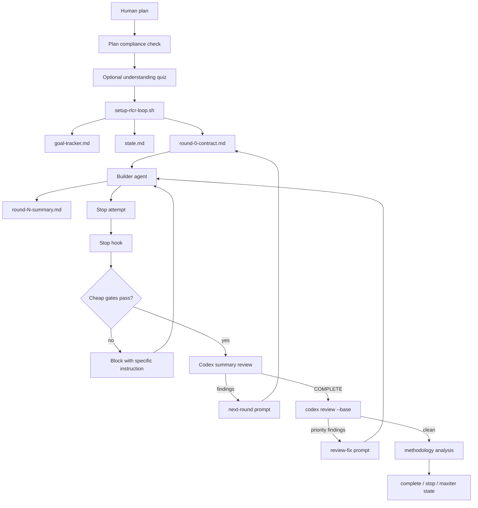

This is the first post in a planned series about agent harnesses. The series is
broader than workflow, but workflow is the right first mechanism to study
because it is where long-running agent work becomes visible as state, gates,
handoffs, and evidence.

The question is practical:

> If a coding agent can already edit files, run commands, and respond to
> feedback, what does an agent harness add?

The short answer is that a harness turns a one-turn assistant into a controlled
work system. It gives the agent a durable objective, scoped tools, evidence
requirements, review boundaries, lifecycle events, and recovery behavior when
the work drifts.

This post studies two concrete systems:

1. **Humanize h1 RLCR**: a workflow-oriented harness that wraps a builder agent
   with plans, round contracts, stop hooks, reviewer pressure, memory deltas,
   drift recovery, and methodology analysis.
2. **Codex review and goals**: two narrower but very clean mechanisms: review
   as a bounded service, and goals as a persistent thread-level objective
   contract with runtime policy.

The goal of the post is not to praise either system. It is to make their
mechanisms reproducible. If you had to rebuild the useful parts from scratch,
this should tell you what objects, state files, prompts, gates, and event
transitions you would need.

The final section then asks why an outside framework such as Puppeteer is still
useful. That discussion is intentionally kept separate from the case studies:
first we understand the systems as they are; only then do we extract design
pressure for Puppeteer.

## Sources

This post is based on two in-progress mechanism studies in the Puppeteer repo:

- `docs/in_progress/design/case_study_humanize_h1_workflow.md`
- `docs/in_progress/design/case_study_codex_review_goal_workflows.md`

Those studies inspect:

- Humanize h1 source at `tmp/repos/humanize`
- Humanize workflow presentation at `tmp/articles/humanize-workflow.pdf`
- Codex source at `tmp/repos/codex`
- OpenAI Cookbook notebook:
  `tmp/articles/using_goals_in_codex.ipynb`

The explanations below are self-contained. They paraphrase and simplify the
source mechanisms so the reader does not need to open those files to understand
the architecture.

## A Working Definition Of Harness

An **agent harness** is not just a prompt template.

It is the system around the agent that answers questions like:

- What is the durable objective?
- What evidence proves the objective is done?
- What tools and files may the agent touch?
- What must happen before the agent is allowed to stop?
- What should be reviewed by another model or by deterministic checks?
- What happens when the agent drifts from the original goal?
- How are state, traces, summaries, failures, and lessons preserved?

In workflow language, a harness looks like steps. In implementation, the useful
pieces are more varied:

```text
Objective state
  durable goal, plan, acceptance criteria, budget, lifecycle status

Evidence surfaces
  tests, benchmarks, diffs, summaries, artifacts, claim ledgers

Agent adapters
  builder, reviewer, analysis agent, sub-agent, one-shot service

Gates
  deterministic checks before model judgement

Review services
  scoped model judgement with narrower capabilities

Runtime policy
  continuation, budget handling, recovery, stop behavior

Trace
  events, summaries, review output, state transitions, methodology notes
```

That distinction matters because "workflow" is not always the right root
abstraction. Sometimes the harness really is a workflow. Sometimes it is a
service call. Sometimes it is persisted state plus event-driven runtime logic.

## Case Study 1: Humanize h1 RLCR

Humanize h1 is easiest to understand as a judgement loop.

It is not "many agents doing work." It is one builder under pressure from a
plan, a state directory, stop hooks, a reviewer, memory discipline, and final
methodology analysis.

The loop's core idea is:

```text
human plan
  -> setup durable loop state
  -> builder works one round
  -> deterministic stop hook checks cheap invariants
  -> Codex reviews the builder's summary
  -> if incomplete, next round prompt narrows the work
  -> if complete, Codex reviews the final diff
  -> if clean, methodology analysis critiques the loop itself
```

### Humanize Reproduction Model

To reproduce the useful part of Humanize h1, implement these objects:

| Object | Purpose | Durable Location |
| --- | --- | --- |
| Plan | Original work scope and acceptance anchor. | User-provided Markdown plan. |
| State file | Round, budget, base commit, model config, drift counters. | `.humanize/rlcr/<timestamp>/state.md` |
| Goal tracker | Immutable goal plus mutable work board. | `.humanize/rlcr/<timestamp>/goal-tracker.md` |
| Round contract | One local mainline objective per round. | `.humanize/rlcr/<timestamp>/round-N-contract.md` |
| Round summary | Builder's evidence packet for the reviewer. | `.humanize/rlcr/<timestamp>/round-N-summary.md` |
| Review result | Codex summary review output. | `.humanize/rlcr/<timestamp>/round-N-review-result.md` |
| Review phase marker | Marks transition from implementation to code review. | `.humanize/rlcr/<timestamp>/.review-phase-started` |
| Methodology report | Post-run critique of the harness method. | `.humanize/rlcr/<timestamp>/methodology-analysis-report.md` |

The important design choice is that these are not chat memories. They are files
that hooks and agents can inspect. A new turn can recover the loop state by
reading the directory.

### Humanize Control Flow



The loop uses two different reviewers:

1. **Implementation review** checks whether the builder's claimed progress
   proves the original plan is done.
2. **Diff review** checks whether the actual final patch has blocking code
   review findings.

Those are different questions. The first is about plan completion. The second
is about patch correctness.

### Start: Plan Pre-Check And Quiz

Humanize does not start from raw user text.

The command first tries to read the plan and ask a plan-compliance agent:

```text
plan compliance checker:
  inspect repository structure
  check whether plan belongs to this repo
  reject branch-switching instructions
  return exactly:
    PASS
    FAIL_RELEVANCE
    FAIL_BRANCH_SWITCH
```

If the output is malformed, the command fails closed.

Then, unless the user opts out, it asks a quiz agent to produce two multiple
choice questions and a plan summary:

```text
plan understanding quiz:
  QUESTION_1: mechanism question
  QUESTION_2: architecture question
  PLAN_SUMMARY

if user misses questions:
  show summary and correct answers
  ask whether to proceed or stop
```

This quiz is advisory friction. It does not prove the plan is good. It catches
the common case where a user accepts a generated plan without understanding
what work is about to be delegated.

### Setup: State Becomes Inspectable

Setup creates `.humanize/rlcr/<timestamp>/state.md`.

The essential state shape is:

```yaml
current_round: 0
max_iterations: 42
codex_model: gpt-5.5
codex_effort: high
codex_timeout: 5400
base_branch: main
base_commit: <fixed merge-base or branch commit>
review_started: false
agent_teams: false
privacy_mode: false
bitlesson_required: false
mainline_stall_count: 0
last_mainline_verdict: unknown
drift_status: normal
```

The state file is the loop's source of truth. It lets the stop hook know which
round is active, whether review phase has started, which base commit should be
used for final diff review, and whether the loop is drifting.

### Goal Tracker: Immutable Goal, Mutable Board

Humanize's goal tracker separates the part that should not drift from the part
that must evolve as the agent learns.

```markdown
# Goal Tracker

## IMMUTABLE SECTION

### Ultimate Goal
<copied or extracted from plan>

### Acceptance Criteria
- AC-1: <observable condition>
- AC-2: <observable condition>

---

## MUTABLE SECTION

### Plan Evolution Log
| Round | Change | Reason | Impact on AC |

### Active Tasks
| Task | Target AC | Status | Tag | Owner | Notes |

### Blocking Side Issues
| Issue | Discovered Round | Blocking AC | Resolution Path |

### Queued Side Issues
| Issue | Discovered Round | Why Not Blocking | Revisit Trigger |

### Completed and Verified
| AC | Task | Completed Round | Verified Round | Evidence |

### Explicitly Deferred
| Task | Original AC | Deferred Since | Justification |
```

This is one of the most important Humanize ideas. It prevents local findings
from silently replacing the original plan. New issues are not ignored, but they
must be classified:

- `mainline`: plan-derived work that directly advances the current objective.
- `blocking`: side issue that prevents current mainline success.
- `queued`: valid follow-up that must not take over the round.

### Round Contract: One Round, One Mainline Objective

Each round must write a round contract before coding:

```markdown
# Round N Contract

- Mainline Objective: <one objective for this round>
- Target ACs: <acceptance criteria this round advances>
- Blocking Side Issues In Scope: <must fix now>
- Queued Side Issues Out of Scope: <valid but not steering>
- Success Criteria: <evidence needed before stop>
```

This contract is the local steering wheel. Review findings can be severe, but
they do not automatically become the new project. The next round must decide
which findings are truly blocking the mainline objective.

### Summary Interface: What Crosses The Inner Review Boundary

The builder writes a round summary:

```markdown
## What Was Implemented
- AC-1: done, evidence: <test or artifact>

## Files Changed
- <path>: <why it changed>

## Validation
- <command>: pass/fail/not run, reason

## Remaining Items
- [mainline] <still required>
- [queued] <follow-up, not blocking>

## BitLesson Delta
- Action: none|add|update
- Lesson ID(s): <IDs or NONE>
- Notes: <what changed and why>
```

The summary is not trusted blindly. It is just the packet that crosses the
inner review boundary. The hook checks that it exists. Codex reviews it against
the plan, goal tracker, and recent history.

### Stop Hook: Cheap Gates Before Model Judgement

The stop hook is the loop's judge of whether the builder is allowed to exit the
current round.

Simplified:

```text
on_stop:
  parse state.md
  reject malformed state
  block branch switch
  block plan mutation during implementation
  block incomplete mainline or blocking tasks
  block missing summary
  block missing round contract
  block uninitialized goal tracker
  block invalid BitLesson Delta
  block max-iteration overflow
  then call Codex summary review
```

This is the cheap critique layer. Deterministic checks remove mechanical
uncertainty before an expensive model reviewer spends judgement.

### Codex Summary Review: Mainline Verdict

The implementation reviewer must classify findings into lanes and provide a
mainline progress verdict:

```markdown
### Mainline Gaps
- <plan-derived work or AC progress missing>

### Blocking Side Issues
- <bug that blocks current mainline objective>

### Queued Side Issues
- <valid follow-up that should not take over>

Mainline Progress Verdict: ADVANCED / STALLED / REGRESSED

<terminal line>
COMPLETE
or
STOP
or
<findings to fix>
```

The `Mainline Progress Verdict` is crucial. A round can fix real bugs and still
fail to advance the plan. Humanize tracks that difference.

### Drift Recovery

If Codex says the mainline stalled or regressed, the hook increments a drift
counter:

```text
if verdict == ADVANCED:
  mainline_stall_count = 0

if verdict in {STALLED, REGRESSED}:
  mainline_stall_count += 1

if mainline_stall_count == 2:
  require drift recovery prompt

if mainline_stall_count >= 3:
  stop with circuit breaker
```

The drift recovery prompt asks the builder to re-read the original plan, update
the goal tracker, and write a recovered round contract with exactly one
mainline objective.

This is how Humanize prevents a side quest from becoming the project.

### Final Diff Review

When summary review says `COMPLETE`, Humanize does not finish immediately.

It moves into review phase:

```text
review_base = base_commit captured at setup
result = codex review --base review_base

if priority findings exist:
  create review-fix prompt
  keep original plan stable
else:
  enter finalize and methodology analysis
```

The fixed base commit matters. Without it, the comparison target can move while
the loop runs, making review ambiguous.

### BitLesson: Memory With Selection And Delta Validation

BitLesson is Humanize's memory discipline.

Before a task, a selector reads the task, related paths, and the current
BitLesson file:

```text
selector input:
  sub-task description
  related file paths
  current .humanize/bitlesson.md

selector output:
  LESSON_IDS: <comma-separated IDs or NONE>
  RATIONALE: <one concise sentence>
```

After the round, the summary must include `## BitLesson Delta`:

```text
Action: none|add|update
Lesson ID(s): <IDs or NONE>
Notes: <what changed and why>
```

The delta validator checks:

- The section exists.
- The action is one of `none`, `add`, `update`.
- `none` has no concrete IDs.
- `add` or `update` has concrete IDs.
- IDs use the expected format.
- IDs exist in the BitLesson file when claimed.
- Notes are present and not placeholder text.

The lesson is that memory should be selected and accountable. The agent should
not silently ignore reusable knowledge, and it should not silently claim it
updated knowledge without evidence.

### Methodology Analysis: The Harness Critiques Itself

After successful completion, Humanize can enter methodology analysis:

```text
enter_methodology_analysis(exit_reason):
  if privacy mode:
    skip
  rename state.md -> methodology-analysis-state.md
  write .methodology-exit-reason
  ask analysis agent to inspect round summaries and review results
  require methodology-analysis-report.md
  require methodology-analysis-done.md
  optionally ask human to file sanitized issue
  rename methodology-analysis-state.md -> complete/stop/maxiter-state.md
```

This turns run traces into method improvement. The analysis is supposed to
criticize the harness, not the project.

### Humanize h1 Mechanism Deck



Start from a plan, not raw intent. Check repository relevance and branch-safety
first. Then optionally quiz the human on the plan to catch delegated work the
human did not understand.



Write round number, budget, model config, base commit, review phase, privacy
mode, BitLesson mode, and drift counters into a state file. Hooks read state
from disk instead of trusting chat memory.



Split immutable goal and acceptance criteria from mutable task state. This
creates a stable plan anchor while still allowing the board to evolve with
findings.



Require one mainline objective per round. Classify side issues as blocking or
queued so reviewer findings cannot silently become the new project.



Make the builder write what changed, why it changed, how it was validated, and
what remains. The reviewer judges this packet against the plan and tracker.



Before model review, block missing summaries, missing contracts, invalid memory
deltas, uninitialized trackers, branch switches, and max-iteration overflow.



Require the reviewer to say whether the original plan advanced, stalled, or
regressed. Local bug fixing is not automatically plan progress.



After repeated stalled or regressed rounds, force a recovery contract. After
more repeated drift, stop instead of letting the loop consume unbounded work.



After summary review says complete, run a final patch review against the fixed
base commit. Plan completion and patch correctness are separate questions.



At the end, inspect the loop records from a method-improvement perspective.
The harness becomes an object that can be criticized and improved.



### Humanize Setup Parameters

Humanize exposes several decisions that matter to reproduction:

| Parameter | Meaning |
| --- | --- |
| `--max` | Maximum implementation rounds before termination. |
| `--codex-model MODEL:EFFORT` | Reviewer model and reasoning effort. |
| `--codex-timeout` | Review command timeout. |
| `--full-review-round` | Cadence for deeper full-alignment review. |
| `--base-branch` and captured `base_commit` | Stable diff-review target. |
| `--track-plan-file` | Blocks silent mutation of the source plan. |
| `--skip-quiz`, `--yolo` | Human can waive advisory plan-friction. |
| `--agent-teams` | Optional thin parallelism wrapper. |
| BitLesson strictness | Controls whether empty memory can keep reporting no lesson. |
| `--privacy` | Skips methodology-sharing path. |

These parameters are not merely CLI details. They are the knobs that decide
how strict, autonomous, private, and expensive the harness is.

## Case Study 2: Codex Review And Goals

Codex offers two mechanisms that are narrower than Humanize but architecturally
clean.

1. **Review** is a bounded service: choose a target, run a narrowed reviewer,
   parse output, record lifecycle events, exit.
2. **Goal** is a persistent contract: store an objective, track lifecycle and
   usage, continue only at safe boundaries, and restrict what status changes
   the model may make.

The lesson is that not every harness feature should be modeled as a workflow
graph. Review is naturally a service. Goal is naturally persisted state plus
runtime policy.

### Codex Review: Reproduction Model

To reproduce Codex review, implement:

| Object | Purpose |
| --- | --- |
| Review target | Defines what evidence the reviewer inspects. |
| Review request | Converts target into a prompt and diff context. |
| Narrow reviewer config | Disables builder-like powers. |
| Review output parser | Parses typed findings, falls back to text. |
| Lifecycle events | Entered review, exited review, assistant message. |
| Inline/detached delivery | Run review in parent thread or forked thread. |

The review prompt makes the role narrow:

```text
You are reviewing changes for bugs.
Report only findings the author would fix.
Prioritize correctness, regressions, security, data loss, and spec violations.

Output JSON:
  findings: [
    title,
    body,
    confidence_score,
    priority,
    code_location
  ]
  overall_correctness
  overall_explanation
  overall_confidence_score
```

The target contract is explicit:

```text
ReviewTarget:
  uncommittedChanges
  baseBranch(branch)
  commit(sha, optional_title)
  custom(instructions)

Validation:
  branch cannot be empty
  commit sha cannot be empty
  custom instructions cannot be empty
```

Base-branch review tries to compute a merge base and review the diff from that
base. If a merge base is unavailable, it falls back to a branch-diff prompt.

### Codex Review: Narrowed Sub-Agent

Review runs as a one-shot sub-agent with reduced authority:

```text
start_review_conversation(request):
  sub_config = copy(parent_config)
  sub_config.web_search = disabled
  sub_config.spawn = disabled
  sub_config.collaboration = disabled
  sub_config.multi_agent = disabled
  sub_config.approval_policy = never
  sub_config.model = review_model if configured else current_model
  sub_config.base_instructions = REVIEW_PROMPT

  run_one_shot_sub_agent(source = Review, prompt = request)
```

This is important. The reviewer is not a normal implementation agent wearing a
different prompt. The configuration narrows what it can do.

### Codex Review: Output Handling

Codex tries to preserve structure without failing the whole review when the
model misses the schema:

```text
process_review_events:
  suppress streaming assistant deltas
  wait for final assistant message
  parse JSON review output
  else parse first JSON object found in text
  else treat text as overall_explanation

exit_review_mode:
  record user_action message containing review output
  emit ExitedReviewMode event
  record assistant message with human-readable review
  materialize rollout
```

The fallback is pragmatic. It preserves review text, but the trace should know
whether the output was structured JSON or plain text. Those are different
evidence quality levels.

### Codex Review: Inline And Detached Delivery

The API supports two delivery modes:

```text
review/start(thread_id, target, delivery = inline):
  validate target
  build display text and ReviewRequest

  if delivery == inline:
    submit Op::Review to existing thread
    review_thread_id = thread_id

  if delivery == detached:
    materialize parent rollout
    load parent history
    fork new review thread
    optionally override model with review_model
    submit Op::Review to child thread
    review_thread_id = child_thread_id
```

Inline review shares the parent thread. Detached review isolates the reviewer
in a fork. That is a clean pattern for any harness: some checks should be part
of the main conversation, while others should run in a separate review lane.

### Codex Goal: Reproduction Model

A Codex goal is thread-scoped durable state:

```json
{
  "threadId": "thr_123",
  "objective": "Reduce p95 latency below 120ms while tests stay green",
  "status": "active",
  "tokenBudget": 200000,
  "tokensUsed": 0,
  "timeUsedSeconds": 0,
  "createdAt": 1776272400,
  "updatedAt": 1776272400
}
```

External clients can manage it:

```text
thread/goal/set:
  create or update current goal
  may set objective, status, token budget
  emits thread/goal/updated

thread/goal/get:
  return current goal or null

thread/goal/clear:
  delete current goal
  emit thread/goal/cleared when state changes
```

The model sees a narrower tool surface:

```text
get_goal():
  read objective, status, budget, token usage, time usage

create_goal(objective, token_budget?):
  only when explicitly requested
  fails if a goal already exists

update_goal(status):
  status must be complete or blocked
  cannot pause, resume, budget-limit, or usage-limit
```

This separates authority:

```text
model:
  complete
  blocked

user/API:
  set
  pause
  resume
  clear

system/runtime:
  budget_limited
  usage_limited
  accounting
  continuation
```

### Goal Authoring: What The Cookbook Adds

The Codex source explains goal state and runtime. The OpenAI Cookbook explains
how a human should write a goal that is worth running.

A normal prompt says:

```text
do this next thing
```

A goal says:

```text
keep working until this outcome is true
```

Strong goals usually include:

```text
outcome:
  what should be true when done

verification surface:
  test, benchmark, report, command output, artifact, or source material

constraints:
  what must not regress

boundaries:
  files, tools, data, repositories, or resources Codex may use

iteration policy:
  how to choose the next attempt after each result

blocked stop condition:
  when no defensible path remains and what input would unlock progress
```

Example:

```text
Weak:
  /goal Improve performance

Strong:
  /goal Reduce p95 checkout latency below 120 ms on the checkout benchmark
        while keeping the correctness test suite green.
```

The stronger version gives Codex an outcome, evidence surface, and constraint.
If latency improves from 180 ms to 135 ms, the goal is not done. If latency
drops below 120 ms but correctness tests fail, the goal is not done.

The Cookbook's research example is even more important. "Reproduce the paper"
is too vague. A stronger research goal asks for:

```text
claim inventory
evidence mapping
feasible local reproductions
approximate support where exact replay is impossible
blocked claims
remaining uncertainty
final report that preserves those distinctions
```

This is the right pattern for agentic research and optimization. The agent can
continue through ambiguity without flattening uncertainty into a false success.

### Codex Goal Continuation

When a goal remains active, Codex injects a continuation prompt:

```text
Continue working toward the active thread goal.

The objective persists across turns.
Do not shrink it to what fits now.
Make concrete progress toward the real requested end state.

Before marking complete:
  derive concrete requirements
  inspect current evidence
  verify every requirement
  do not mark complete from partial progress

Before marking blocked:
  do not stop on first blocker
  same blocker must recur across multiple goal turns
  blocked means no meaningful progress is possible
```

The goal is not higher-priority instruction. It is user-provided state that the
runtime keeps visible and bounded.

### Budget And Objective Updates

When token budget is exhausted, runtime owns the transition:

```text
status = budget_limited
inject budget-limit prompt
tell agent:
  stop new substantive work
  summarize progress
  list remaining work
  do not call update_goal unless actually complete
```

When the user edits the objective while a turn is running:

```text
external objective update:
  account current progress
  update state DB
  emit ordered notification
  inject objective-updated prompt
  tell agent new objective supersedes old objective
```

This prevents the agent from acting on stale goal state.

### Goal Runtime Event Switch

The runtime is event-driven:

```text
TurnStarted:
  capture active goal id
  capture token/time baseline

ToolCompleted:
  account usage
  maybe inject budget steering

ToolCompletedGoal:
  account usage before goal update

TurnFinished:
  account final usage
  clear continuation reservation

UsageLimitReached:
  mark active goal usage_limited

ExternalSet:
  account before mutation
  update runtime state
  maybe inject objective-updated steering

ExternalClear:
  clear runtime state

ThreadResumed:
  restore active-goal accounting if status is active

MaybeContinueIfIdle:
  start continuation if active, idle, and no queued input
```

This is why goals are not just workflow steps. They are state observed by
runtime policy.

### Codex Mechanism Deck



Review starts from a typed target: uncommitted changes, base branch, commit, or
custom instructions. Empty targets are rejected before the reviewer runs.



The reviewer is a one-shot sub-agent with web search, spawning, collaboration,
and approval prompts disabled. It reviews; it does not build.



Codex parses JSON findings when possible, then tries a JSON substring, then
falls back to plain text. The trace should preserve the parse quality.



Inline review writes into the parent thread. Detached review materializes
history and forks a separate review thread for isolation.



A goal is a persisted thread object with objective, status, budget, usage, and
timestamps. It is not just text in the current prompt.



The model can mark complete or blocked. User/API controls set, pause, resume,
and clear. Runtime controls budget and usage statuses.



Strong goals name outcome, evidence, constraints, boundaries, iteration policy,
and blocked stop condition. This is the user-facing half of the contract.



Continuation prompts require requirement-by-requirement verification before
`complete`. Improvement or plausible intent is not enough.



Continuation starts only when goals are enabled, the thread is idle, no input
is queued, the mode allows it, and the goal is still active.



If the user edits the objective mid-run, runtime updates state and injects a
prompt telling the agent the new objective supersedes the old one.



### Codex Goal Setup Decisions

| Decision | Effect |
| --- | --- |
| Materialized thread required | Goals need durable state DB storage. |
| Objective text | Human-facing canonical target, but weak without evidence semantics. |
| Token budget | Bounds autonomous continuation. |
| Model tool restrictions | Prevents model from owning pause, resume, budget, and usage states. |
| Completion audit prompt | Prevents shrinking the goal to local progress. |
| Blocked recurrence | Prevents premature "blocked" labels. |
| Idle continuation guard | Prevents background work when thread is active or user input is queued. |
| External mutation handling | Keeps active turns aligned with changed objectives. |
| `/goal pause/resume/clear` | Gives user lifecycle control. |

## Comparing The Two Harness Shapes

Humanize and Codex solve overlapping problems with different shapes.

| Concern | Humanize h1 | Codex Review | Codex Goals |
| --- | --- | --- | --- |
| Main abstraction | Workflow loop | Bounded service | Persistent contract plus runtime policy |
| Objective | Plan and goal tracker | Review target only | Thread goal objective |
| Evidence | Summary, tests, tracker, diff, BitLesson | Diff or custom target | User-defined evidence in objective |
| Stop control | Stop hook blocks exit | One-shot service exits | Runtime continuation and goal status |
| Review | Codex summary review and diff review | Review service itself | Optional; not built into goal |
| Drift handling | Mainline verdict and drift recovery | Not applicable | Completion and blocked audits |
| Memory | BitLesson selector and delta | Conversation review artifact | Persisted goal state and usage |
| Self-improvement | Methodology analysis | Trace only | Goal trace and accounting |

Humanize is heavier but demonstrates a full long-task development loop. Codex
is smaller but cleaner in separating service, contract, and runtime policy.

## What Is Missing In These Harnesses?

Both systems are useful, but both leave gaps for project-wide strategy
evolution.

### 1. Objective Semantics Are Still Too Textual

Humanize has a plan and goal tracker. Codex has a goal string plus runtime
state. The Cookbook shows how to write strong goal prose.

But prose is not enough for project evolution.

A target project often needs objective services such as:

```text
acceptance_criteria()
evidence_requirements()
allowed_artifacts()
benchmark_budget()
correctness_oracle()
domain_constraints()
blocked_evidence_threshold()
```

Those should be programmable. For example, a kernel-evolution target should
not rely on a prompt sentence to explain numerical tolerance, benchmark
commands, GPU constraints, and allowed files.

### 2. Evidence Needs Types And Grades

Humanize has summaries and reviews. Codex goals ask for evidence. The research
example shows that evidence can be exact, approximate, proxy, blocked, or
unknown.

Most harnesses still flatten this too much.

For strategy evolution, evidence should be typed:

```text
Exact:
  deterministic test, verified reproduction, exact metric threshold

Approximate:
  trained replacement, close numerical match, statistical support

Proxy:
  benchmark related to production but not identical

Blocked:
  missing data, unavailable hardware, missing upstream artifact

Unknown:
  not checked yet, inconclusive, contradictory runs
```

Without typed evidence, an agent can overclaim success.

### 3. Workflow Is Too Often The Root Object

Humanize looks workflow-centric because the user runs one loop. Codex goals
look less workflow-centric because continuation is runtime policy over state.

For a general framework, workflow should not own everything.

A better decomposition is:

```text
Service:
  bounded request/response, such as review(target)

Contract:
  durable state and allowed operations, such as objective or target

Policy:
  event-driven behavior over contracts and services, such as continuation

Trace:
  request, response, evidence, status change, degraded output, reviewer finding
```

Workflow can be a policy. It should not be the only way to express the system.

### 4. Harness Evolution Is Not First-Class Enough

Humanize methodology analysis is a strong idea: the run should critique the
method, not only the project. Codex traces lifecycle and usage events.

But a general harness should make the harness itself inspectable:

```text
Which service calls happened?
Which gates blocked work?
Which evidence was missing?
Which prompts caused drift?
Which review findings repeated?
Which contract fields were too weak?
Which policies launched wasteful work?
```

Those traces should become inputs for improving the harness.

### 5. The User Interface For Harness Power Is Still Hard

Codex's `/goal` command is easy. Humanize's RLCR is powerful but heavier.

A general framework needs progressive disclosure:

```text
Level 0:
  one prompt or one workflow

Level 1:
  add a goal/objective contract

Level 2:
  add evidence services and review gates

Level 3:
  add memory, drift recovery, and methodology analysis

Level 4:
  let agents inspect traces and improve the harness itself
```

Users should not pay setup cost for features they do not need.

## What This Suggests For Puppeteer

The case studies suggest Puppeteer's position:

> Puppeteer should be an outside project-improvement harness that lets a target
> project expose programmable contracts and services to one or more agents,
> while the harness mediates communication, evidence, gates, policies, and
> traces.

This is not the same as replacing Humanize or Codex.

Humanize is a workflow-rich harness. Codex goals are a clean thread-objective
mechanism. Puppeteer should learn from both while targeting a broader use case:
strategy evolution inside arbitrary projects.

### Puppeteer's Missing Layer

The missing layer is not "more workflow nodes." It is a communication and
contract layer:

```text
Harness-mediated request:
  caller -> contract/service -> response -> trace

Examples:
  policy -> target.benchmark(candidate) -> BenchmarkResult
  policy -> objective.check_completion(evidence) -> CompletionDecision
  policy -> review.review(packet) -> ReviewDecision
  policy -> memory.select(task, files) -> KnowledgePacket
```

This layer gives several benefits:

- Components are only defined when needed.
- Services can be traced uniformly.
- Agents can inspect the traces and improve the system.
- Workflow can stay decoupled from target-specific details.
- The same project can start simple and add structure over time.

### What Puppeteer Should Provide Easily

The case studies point to a concrete product surface.

Puppeteer should make these easy:

1. Define an objective contract with optional authoring fields:
   outcome, evidence, constraints, boundaries, iteration policy, blocked
   condition.
2. Define target services:
   run benchmark, check correctness, inspect artifacts, compare candidates,
   extract strategy scopes.
3. Define review services:
   summary review, diff review, evidence review, claim-ledger review.
4. Define gates:
   deterministic checks before model judgement.
5. Define policies:
   simple workflow, Humanize-like RLCR, Codex-goal-like continuation, or custom
   target evolution loop.
6. Record traces:
   every request, response, degraded output, evidence packet, review decision,
   state transition, and blocked reason.
7. Support progressive disclosure:
   a user can run a workflow-only harness first, then add contracts and
   services only when the target needs them.

### A Minimal Puppeteer-Like Shape

```python
objective = harness.contract("objective")
target = harness.contract("target")
review = harness.service("review")

@policy.on("round")
def evolve(ctx):
    candidate = ctx.agent.propose_change(objective.current())
    evidence = target.evaluate(candidate)
    decision = review.check(objective=objective.snapshot(), evidence=evidence)

    ctx.trace.record(candidate=candidate, evidence=evidence, decision=decision)

    if decision.complete:
        objective.update_by_model("complete")
    elif decision.blocking:
        objective.record_blocker(decision)
    else:
        ctx.agent.continue_with(decision.next_prompt())
```

This sketch is intentionally not a fixed workflow DSL. It is normal code
calling contracts and services through a harness.

## Takeaways

Humanize h1 shows why a long-task coding loop needs plans, round contracts,
cheap gates, review pressure, memory discipline, drift recovery, and
methodology analysis.

Codex review shows how a narrowly scoped review service should work: typed
target, reduced tool surface, structured output, fallback, lifecycle events,
and optional detached delivery.

Codex goals show how a durable objective should work: persisted state,
caller-specific permissions, runtime accounting, safe continuation,
budget/usage statuses, external mutation handling, and completion audits.

The OpenAI Cookbook shows the missing human-facing layer: a goal should encode
outcome, evidence, constraints, boundaries, iteration policy, and blocked stop
condition.

Puppeteer should not simply copy any one of these. Its job is to provide the
outside framework where target projects can define their own contracts and
services, agents can operate through those interfaces, and the harness can
trace and improve the whole process.
