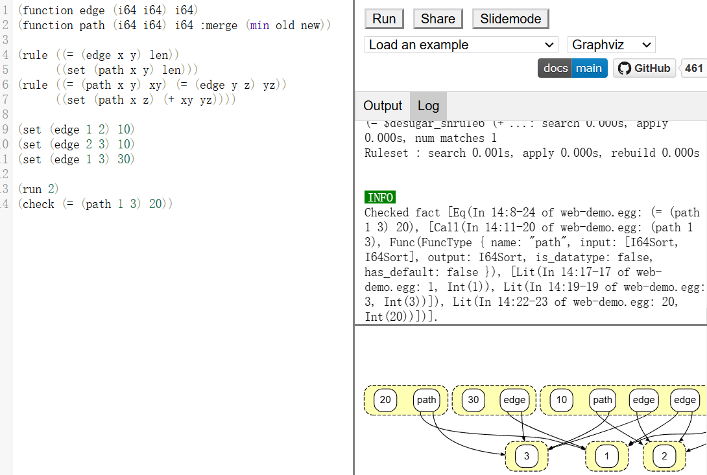

# Term Rewrite, E-Graph, and?

---

## Term Rewrite System (TRS)

$$
\begin{align*}
 \text{term\quad}   t &= (a + 0) + (b + 0) \\
 \text{context\quad}   c &= \_ + (b + 0) \\
 \text{substitution\quad}
    \sigma &= \{x \mapsto a\} \\
 \text{rewrite\quad}   l \to r &= (x+0) \to x \\
 \text{left of rewrite\quad}   l\sigma &= a + 0 \\
 \text{right of rewrite\quad}  r\sigma &= a \\
    &\text{now putting it all together...} \\
    t = c[l\sigma] &= (a + 0) + (b + 0) \to \\ 
    c[r\sigma] &= a + (b + 0)
\end{align*}
$$ 

---

### More about TRS

- Termination: no infinite sequences of rewrites
  - $x*(y+z) \to x*y + x*z$ terminates?
  - reduction ordering? s.t. $x*(y+z) > x*y + x*z$
- Confluence: the order of rewrites doesn’t matter
  - $
  \begin{array}{ccc}
      t &\to^*  &t_1 \\
    \downarrow^* & &\downarrow^* \\
    t_2 &\to^* &t' \\
\end{array}
$
- Completion: transform equations into confluent TRS
- Stategies: controls the applications of term rewriting

---
<!-- _footer: 'Achieving High-Performance the Functional Way: A Functional Pearl on Expressing High-Performance
Optimizations as Rewrite Strategies, ICFP 2020. https://doi.org/10.1145/3408974' -->

#### Optimizations as Rewrite Strategies


```scala
type Strategy[P] = P => RewriteResult[P]
RewriteResult[P] = Success[P](P)
                 | Failure[P](Strategy[P])
type Traversal[P] = Strategy[P] => Strategy[P]

def ‘@‘[P](s: Strategy[P], t: Traversal[P]) = t(s)
def outermost: Strategy[Rise] => Traversal[Rise] = 
  pred => s => topDown(pred ‘;‘ s)
// tiling 32x32, nest level 2 in ELEVATE
(tile(32,32) ‘@‘ outermost(mapNest(2)))(mm)
```

<!-- 
-  Strategies encode program transformations
-  Rewrite rules are strategies
-  Strategies as compositions
-  Use traversals to describe at which exact location a strategy is applied
-->

---


## E-graph

---

### E-graph?

- first used in verification
- equality with uninterpreted functions
- if $f(x,y) = x$, $f(f(x,y),y)=x$ ???


> QF-EUF: quantifier-free equality with uninterpreted functions


---

#### What is an e-graph?


<div class="auto-columns">

<div>

$$
\begin{align*}
\text{function symbols\quad} & f,g \\
\text{e-class ids\quad} & a,b \\
\text{e-nodes\quad} & n ::= f|f(a_1,\dots,a_m) \\
\text{e-classes\quad} & c ::= \{n_1,\dots,n_m\}
\end{align*}
$$

<hr>


<style scoped>
  p {
        font-size: 0.8em;
   }
  li {
    font-size: 0.7em;
  }
</style>

An e-graph is a tuple $(U,M,H)$, where:
- *Hashcons* $H$ is a map from e-nodes to e-class ids.
- A *union-find* data structure $U$ stores equivalance retions e-class ids.
- *E-class map* $M$ maps e-class ids to e-classes. All equivalent e-class ids map to the same e-class.


</div>

<div>


</div>
</div>

---

#### Operations in e-graph

- Mutation
  - `add`: takes an e-node, (insert an e-class if not exist)$^?$, returns the e-class id;
  - `merge`: unions two e-class ids;
- Query
  - `find`: canonicalizes e-class id with *union-find*;
  - `ematch`: performs *e-matching* for finding patterns in the e-graph.

---

#### More about *e-matching*

- input: a pattern term $p$ with variables
- output: a list of tuples $(\sigma, c)$
  - $\sigma$ is a substitution of variables to e-class ids
  - $p[\sigma]$ is represented in e-class $c$
- example: e-matching $f(\alpha, g(\alpha))$

```
for e-class c in e-graph E:
  for f-node n1 in c:
    subst = {root ↦ c, α ↦ n1.child1}
    for g-node n2 in n1.child2:
        if subst[α] = n2.child1:
            yield subst
```

---

#### Rewriting over e-graph

- rewrite: $l \to r$
- `ematch` $l$ to find tuples $(\sigma, c)$, $c$ represents $l[\sigma]$
- for each $(\sigma, c)$, `merge`($c$, `add`($r[\sigma]$))

<div class="columns3">
<div>


</div>
<div>


<br>
<br>


```
(Div (Mul a two) two)
```


$$
\xrightarrow{\texttt{(rewrite (Mul a two) (Shl a (Num 1)))}}
$$


```
(Div (Shl a (Num 1)) two)
; (Div (Mul a two) two) still exists
```

 
</div>
<div>


</div>
</div>

---

### Equality Saturation: why? and how?

- Term rewriting is *destructive* -- forgets *LHS*
  - *Phase ordering* problem: when to apply which?
  - $(a*2)/2 \to (a<<1)/2 \to ? \to a*1 \to a*1*1 \to ? \to a$
- **EqSat**: apply all rewrites, keeping track of every discovered expression, in e-graph.


<div class="columns">
<div>


</div>
<div>

```python
def equality_saturation(expr, rewrites): 
  egraph = initial_egraph(expr) 
  while not egraph.is_saturated_or_timeout(): 
    for rw in rewrites: 
      for (subst, eclass) in egraph.ematch(rw.lhs): 
        eclass2 = egraph.add(rw.rhs.subst(subst)) 
        egraph.merge(eclass, eclass2) 
  return egraph.extract_best()
```

</div>
</div>

---


#### EqSat + extraction

<div class="columns4">

<div>


</div>
<div>

```
(rewrite (Mul a two) 
         (Shl a (Num 1)))
(rewrite (Div (Mul %x %y) %z) 
         (Mul %x (Div %y %z)))
(rewrite (Div %x %x) one)
(rewrite (Mul %x one) %x)
```

$$
\xrightarrow{\text{apply EqSat rewrites}}
$$

</div>
<div>


</div>
<div>

```
(extract (Div (Mul a two) two))

; outputs:
;   (Var "a")
```

$$
\begin{aligned}
\\
\\
\text{success: } (a*2)/2 \to a
\end{aligned}
$$

</div>
</div>

---
<style scoped>
  li {
    font-size: 0.8em;
  }
</style>

<!-- _footer: 'Egg: Fast and extensible equality saturation. POPL 2021. https://doi.org/10.1145/3434304' -->

### So what's egg?

> first general-purpose, reusable implementation of e-graphs and equality saturation 
> **MAKES E-GRAPH GREAT AGAIN**

What's new?
  - *rebuilding* for amortized invariant maintenance
    - **fast EqSat**: 20.96× speedup. GPU? ray-tracing-alike? 
  - *e-class analysis*: abstract interpretation in e-graph
    - a domain $D$, value $d_c \in D$ for each e-class $c$
    - conditional rewrites: $x/x \to 1$ only if $x \neq 0$

---

#### Egg in action: Herbie

<div class="columns">
<div>

Herbie uses e-graphs for algebraic simplification of mathematical expressions

> The egg backend is over 3000× faster than Herbie’s initial simplifier

</div>
<div>

```
Find and fix floating-point problems:

sqrt(x+1) - sqrt(x) 
  ->  1/(sqrt(x+1) + sqrt(x))

accuracy: 53.1% -> 99.7%
```

</div>
</div>


---

<!-- _footer: 'Automating Constraint-Aware Datapath Optimization using E-Graphs. DAC 2023,doi: 10.1109/DAC56929.2023.0247797.' -->

<style scoped>
  p {
    font-size: 0.8em;
  }
</style>

#### Egg in action: datapath optimization


**Abstract domain**: $\mathcal{A} = \left\{ \bigcup_{i=1}^n [a_i, b_i] \right\}$
$$
[\texttt{ASSUME}(x,c)] = \begin{cases}
       [x] &\quad\text{if } [c]\\
       \hspace{0.4em}* &\quad \text{else.} \\
     \end{cases}  
$$

<!-- Suppose $\mathcal{A}[x]=[-3,3]$, then $\mathcal{A}[\texttt{ASSUME}(x,x>0)]=[1,3]$ -->

$$
\begin{align*}
&(x=y)?x+y:0 \quad \to \quad (z=0)?z+2y:0 \quad \to \\
&(z=0)?\texttt{ASSUME}(z+2y,z=0):\texttt{ASSUME}(0,z\neq 0) \\
& \textbf{Extract: \quad } (x=y)?2y : 0
\end{align*}
$$

**Constraint? Context!**
[Colored e-graph](https://arxiv.org/abs/2305.19203)

---

### More about extraction

<style scoped>
  .auto-columns {
    display: grid;
    grid-template-columns: 70% 25%;
    gap: 0.3rem;
  }
  li {
    font-size: 0.8em;
  }
</style>

<div class="auto-columns">

<div>

The target e-class represents 
  $(a*2)/2$, $a$, $a*1$, ...
which one to extract?
pick the smallest (cheapest) one

- **Valid extraction**: 
  1. if we extract an e-class, we have to extract at least one of its members
  2. if we extract an e-node, we must also extract all of its children
- **Optimal extraction**:
  - a valid extraction that includes all the target e-classes and has the smallest total cost
</div>
<div>


$$
\textbf{NP-HARD!}
$$
</div>
</div>

---

#### ILP extraction

<div class="auto-columns">

<div>

Variables: 
$v_x$ for each e-node $x$


Objective:
  $$\min \sum_{x} \text{cost}(x) v_x$$

$$
\begin{aligned}
\\
\\
\textbf{ILP, SLOW!!!}
\end{aligned}
$$

</div>
<div>

Constraints:
  - Root constraints: 
   $$\sum_{x \in \text{Root}} v_x \geq 1$$
  - Class constraints
   $$-v_x + \sum_{y \in C_i} v_y \geq 0$$ 
   for each child $C_i$ of $x$
  - Acyclic constraints
</div>
</div>

---

#### Treewidth extraction for sparse e-graphs

<!--  -->

<style scoped>
  .auto-columns {
    display: grid;
    grid-template-columns: 60% 35%;
    gap: 0.3rem;
  }
  li {
    font-size: 0.8em;
  }
  p.redp {
    font-size: 0.8em;
    font-style: italic;
  }
</style>

<div class="auto-columns">
<div>

$$
\begin{aligned}
\text{Tree decomposition: } & G=(V,E) \xrightarrow{decompose} T=(\mathcal{B}, E_T) \\
\text{Bag: }& b \in \mathcal{B}, V_b \subseteq V \\
\text{Vertex cover: }& \bigcup_{b \in \mathcal{B}} V_b = V \\
\text{Edge cover: }& \forall (u, v) \in E,  \exists b \in \mathcal{B}, \{u, v\} \subseteq V_b \\
\text{Coherence: }& \forall b_1,b_2 \in \mathcal{B}, V_{b_1} \cap V_{b_2} \subseteq V_{b'} \\
& \text{ for every } b' \text{ on the path from } b_1 \text{ to } b_2 \text{ in } T \\
\\
\text{Treewidth: }& \max_{b \in \mathcal{B}} |V_b| - 1 \\
\\
\text{Cut property: }& \text{every bag is a cut.}
\end{aligned}
$$

```
Intuition: 
when treewidth is small, every bag is small, 
and we can enumerate extraction within each bag; 
and thanks to the cut property, 
we can conduct dynamic programming over bags.
```

</div>
<div>


$O(n \cdot 5^k \cdot k)$

<p class="redp">But, decomposition is slow!</p>

</div>
</div>


---

#### Extraction in E-Syn

<!--_footer: 'E-Syn: E-Graph Rewriting with Technology-Aware Cost Functions for Logic Synthesis. DAC 2024, url: https://arxiv.org/abs/2403.14242'-->

> E-GRAPH REWRITING FOR LOGIC SYNTHESIS

<div class="auto-columns">
<div>

- Regression: XGBoost model to fit the area and delay cost from the AST of a Boolean expression
  - cost model is not linear or monotonic

</div>
<div>

- *Pool extraction*: heuristics + random sampling + apply XGBoost model
  - tradeoff between local heuristics and ILP
  - need ~100+ samples

</div>
</div>

---


### E-graph for compiler 

---

#### No-egg rewrite-based optimizer

> *Phase ordering problem* is SEVERE! *CF* is HARD!

<style scoped>
  .auto-columns {
    display: grid;
    grid-template-columns: 50% 50%;
    gap: 0.3rem;
  }
  p {
    font-size: 0.8em;
  }
  li {
    font-size: 0.8em;
  }
</style>

<div class="auto-columns">
<div>

[PEG and E-PEG](https://arxiv.org/pdf/1012.1802)


</div>
<div>

[ægraphs](https://github.com/bytecodealliance/rfcs/blob/main/accepted/cranelift-egraph.md)[[slide](https://cfallin.org/pubs/egraphs2023_aegraphs_slides.pdf)]

- accepted in Cranelift compiler 
  - part of Wasmtime
- Solution
  - e-graph + CFG skeleton
  - persistent immutable data structure
- Restricted but fast!
</div>
</div>

--- 

#### E-graph for instruction selection

<style scoped>
  .auto-columns {
    display: grid;
    grid-template-columns: 50% 50%;
    gap: 0.3rem;
  }
  p {
    font-size: 0.8em;
  }
</style>

<div class="auto-columns">
<div>

[Diospyros](https://dl.acm.org/doi/10.1145/3445814.3446707)


low-level instr. as e-nodes
*fully-unrolled kernel*
EqSat TIMEOUT! 
e.g. `MatMul 8*8*8`

</div>
<div>


[Isaria](https://dl.acm.org/doi/10.1145/3617232.3624873) (using [Ruler](https://dl.acm.org/doi/pdf/10.1145/3485496))


Even with phasing, Isaria is slower than Diospyros!

</div>
</div>

---

#### E-graph for instruction finding

<style scoped>
  .auto-columns {
    display: grid;
    grid-template-columns: 50% 50%;
    gap: 0.3rem;
  }
</style>

<div class="auto-columns">
<div>

[Isaria](https://dl.acm.org/doi/10.1145/3617232.3624873) makes adding a new instruction easy
```
(match inst
; ...
  [(sqrt-add e1 e2) (+ (sqrt e1) e2)]
  [(vec-sqrt-add v1 v2) 
    (for/list ([e1 v1] [e2 v2])
      (sqrt-add e1 e2))]
)
```
Rewrites are auto-generated!

> I fail to run Isaria...

</div>
<div>

What instructions? [Babble](https://dl.acm.org/doi/10.1145/3571207)

<!-- [Babble](https://dl.acm.org/doi/10.1145/3571207): library learning modulo theories -->


</div>
</div>

---

### Beyond EqSat?

---

<!-- _footer: 'Better Together: Unifying Datalog and Equality Saturation. PLDI 2023, url: https://dl.acm.org/doi/10.1145/3591239' -->
#### [Egglog](https://dl.acm.org/doi/10.1145/3591239) = Egg + Datalog


[[tutorial](https://www.youtube.com/watch?v=N2RDQGRBrSY)] [[demo](https://egraphs-good.github.io/egglog/)]


<style scoped>
  li {
    font-size: 0.8em;
  }
</style>

<div class="auto-columns">
<div>



</div>
<div>

[Egglog](https://dl.acm.org/doi/10.1145/3591239) is a powerful language!

- rich features:
  - multi-patterns, incrementality
  - functions + equality
  - ...

[[demo](https://egraphs-good.github.io/egglog/)] is a good place to try ideas!

</div>
</div>


<!-- ### What we need?

> instruction finding from domain of applications

- program rewrites: [eggcc](https://github.com/egraphs-good/eggcc)? [jlm](https://github.com/phate/jlm)? what else? 
- tractable EqSat: 
  - pruning ([Isaria](https://dl.acm.org/doi/10.1145/3617232.3624873))? guiding ([egg-sketch](https://dl.acm.org/doi/10.1145/3632900))?
- learn instruction: 
  - what to learn? acceptable instr.? cost model?
  - how to learn? [Babble](https://dl.acm.org/doi/10.1145/3571207)?
  - more efficient extraction? -->
